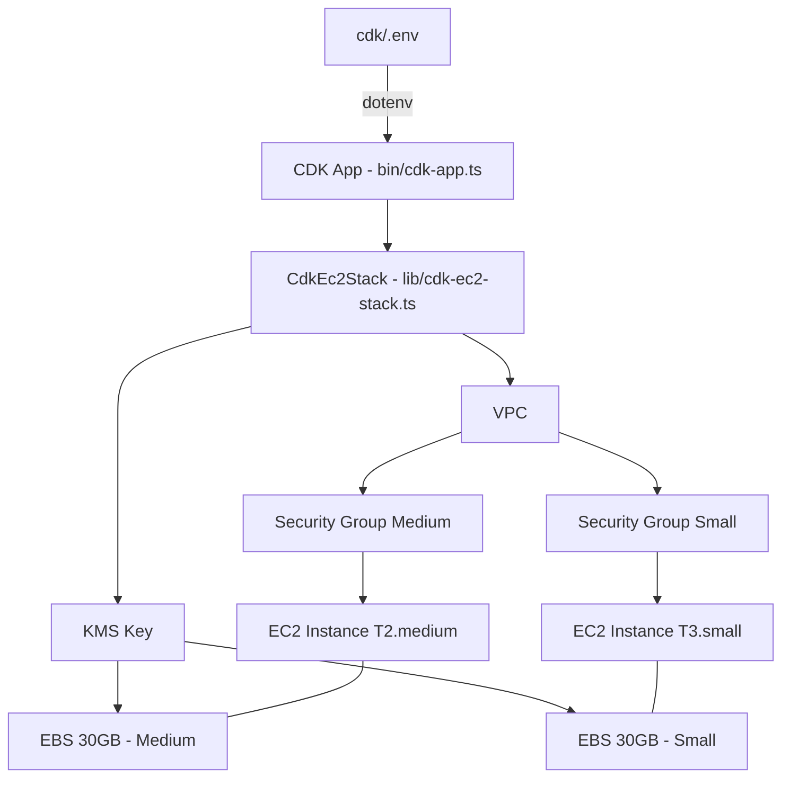

# Design Document: CDK EC2 Deployment

## Overview

Ce design décrit l'architecture d'un projet AWS CDK en TypeScript situé dans le répertoire `cdk/`. Le projet déploie deux instances EC2 (T2.medium et T3.small) dans un VPC partagé, chacune avec son propre security group et un volume EBS de 30 Go chiffré via une clé KMS dédiée. Les variables d'environnement sont chargées depuis `cdk/.env` via `dotenv`.

Le projet suit une structure CDK standard minimale : un point d'entrée (`bin/`), une stack unique (`lib/`), et les fichiers de configuration CDK habituels.

## Architecture



### Structure du projet CDK

```
cdk/
├── bin/
│   └── cdk-app.ts          # Point d'entrée CDK, charge .env, instancie la stack
├── lib/
│   └── cdk-ec2-stack.ts    # Définition de la stack (VPC, KMS, SGs, EC2)
├── cdk.json                 # Configuration CDK
├── tsconfig.json            # Configuration TypeScript
├── package.json             # Dépendances (aws-cdk-lib, dotenv, etc.)
├── .env                     # Variables d'environnement (non versionné)
└── .env.example             # Template des variables attendues
```

### Flux de démarrage

1. `bin/cdk-app.ts` charge `cdk/.env` via `dotenv`
2. Validation des variables obligatoires (`CDK_DEFAULT_ACCOUNT`, `CDK_DEFAULT_REGION`, `DOMAIN`)
3. Instanciation de `CdkEc2Stack` avec `env: { account, region }`
4. La stack crée les ressources dans l'ordre : VPC → KMS Key → Security Groups → EC2 Instances (avec EBS chiffrés)

## Components and Interfaces

### 1. Point d'entrée CDK (`bin/cdk-app.ts`)

Responsabilités :
- Charger les variables d'environnement depuis `cdk/.env` via `dotenv.config()`
- Valider la présence des variables obligatoires
- Créer l'instance `cdk.App`
- Instancier `CdkEc2Stack` en passant `env: { account, region }`

```typescript
import * as dotenv from 'dotenv';
import * as path from 'path';
import * as cdk from 'aws-cdk-lib';
import { CdkEc2Stack } from '../lib/cdk-ec2-stack';

dotenv.config({ path: path.resolve(__dirname, '../.env') });

const requiredVars = ['CDK_DEFAULT_ACCOUNT', 'CDK_DEFAULT_REGION', 'DOMAIN'];
for (const varName of requiredVars) {
  if (!process.env[varName]) {
    throw new Error(`Variable d'environnement manquante : ${varName}`);
  }
}

const app = new cdk.App();
new CdkEc2Stack(app, 'CdkEc2Stack', {
  env: {
    account: process.env.CDK_DEFAULT_ACCOUNT,
    region: process.env.CDK_DEFAULT_REGION,
  },
});
```

### 2. Stack principale (`lib/cdk-ec2-stack.ts`)

Responsabilités :
- Créer le VPC avec un sous-réseau public
- Créer la clé KMS pour le chiffrement EBS
- Créer deux security groups distincts (un par instance), chacun dans le VPC
- Créer deux instances EC2 avec AMI Amazon Linux 2023, volumes EBS 30 Go chiffrés

```typescript
import * as cdk from 'aws-cdk-lib';
import * as ec2 from 'aws-cdk-lib/aws-ec2';
import * as kms from 'aws-cdk-lib/aws-kms';
import { Construct } from 'constructs';

export class CdkEc2Stack extends cdk.Stack {
  constructor(scope: Construct, id: string, props?: cdk.StackProps) {
    super(scope, id, props);
    // VPC, KMS, SGs, EC2 instances defined here
  }
}
```

### Ressources créées par la stack

| Ressource | Construct CDK | Configuration clé |
|---|---|---|
| VPC | `ec2.Vpc` | `maxAzs: 2`, sous-réseau public |
| KMS Key | `kms.Key` | `enableKeyRotation: true` |
| SG Medium | `ec2.SecurityGroup` | VPC partagé, SSH (port 22) entrant |
| SG Small | `ec2.SecurityGroup` | VPC partagé, SSH (port 22) entrant |
| EC2 Medium | `ec2.Instance` | `t2.medium`, AMI Debian, EBS 30 Go chiffré |
| EC2 Small | `ec2.Instance` | `t3.small`, AMI Debian, EBS 30 Go chiffré |

## Data Models

### Variables d'environnement

Le fichier `cdk/.env` suit le format défini dans `cdk/.env.example`. Les variables pertinentes pour la stack CDK :

| Variable | Obligatoire | Description |
|---|---|---|
| `CDK_DEFAULT_ACCOUNT` | Oui | ID du compte AWS cible |
| `CDK_DEFAULT_REGION` | Oui | Région AWS de déploiement |
| `DOMAIN` | Oui | Nom de domaine utilisé pour le nommage/tagging |

Les autres variables du `.env.example` (DATABASE_URL, SECRET_KEY, etc.) sont des variables applicatives qui ne sont pas utilisées par la stack CDK elle-même.

### Configuration des instances EC2

```typescript
interface Ec2InstanceConfig {
  instanceType: ec2.InstanceType;   // t2.medium ou t3.small
  machineImage: ec2.IMachineImage;  // Debian (latest)
  vpc: ec2.IVpc;
  securityGroup: ec2.ISecurityGroup;
  blockDevices: ec2.BlockDevice[];  // EBS 30 Go, chiffré KMS
}
```

### Configuration EBS

```typescript
// Pour chaque instance
{
  deviceName: '/dev/xvda',
  volume: ec2.BlockDeviceVolume.ebs(30, {
    encrypted: true,
    encryptionKey: kmsKey,
    volumeType: ec2.EbsDeviceVolumeType.GP3,
  }),
}
```


## Correctness Properties

*A property is a characteristic or behavior that should hold true across all valid executions of a system — essentially, a formal statement about what the system should do. Properties serve as the bridge between human-readable specifications and machine-verifiable correctness guarantees.*

### Property 1: Stack environment propagation

*For any* valid pair of `CDK_DEFAULT_ACCOUNT` and `CDK_DEFAULT_REGION` strings loaded from environment variables, the synthesized CloudFormation stack should have its `account` and `region` matching those exact values.

**Validates: Requirements 1.2**

### Property 2: Required variable validation

*For any* required environment variable (`CDK_DEFAULT_ACCOUNT`, `CDK_DEFAULT_REGION`, `DOMAIN`) that is absent from the environment, the application should throw an error whose message contains the name of the missing variable.

**Validates: Requirements 2.4**

### Property 3: VPC structure invariant

*For any* successfully synthesized stack, the CloudFormation template should contain exactly one VPC resource with at least one public subnet, and both EC2 instances should reference that same VPC.

**Validates: Requirements 3.1, 3.2, 3.3**

### Property 4: KMS encryption invariant

*For any* successfully synthesized stack, the CloudFormation template should contain a KMS Key resource, and both EC2 instances' EBS block device mappings should reference that KMS key for encryption.

**Validates: Requirements 4.1, 4.2**

### Property 5: Security groups invariant

*For any* successfully synthesized stack, the template should contain two distinct security group resources, both referencing the shared VPC, with each EC2 instance associated to its own dedicated security group.

**Validates: Requirements 7.3, 7.4, 7.5**

## Error Handling

| Scénario | Comportement attendu |
|---|---|
| Fichier `cdk/.env` absent | `dotenv` ne charge rien → la validation des variables obligatoires lève une `Error` explicite |
| Variable obligatoire manquante | Boucle de validation lève une `Error` nommant la variable manquante |
| Synthèse CDK échoue | Erreur CDK standard propagée (pas de gestion custom nécessaire) |
| Compte/Région invalide | Erreur au moment du `cdk deploy`, pas à la synthèse (comportement CDK natif) |

La stratégie d'erreur est simple : fail fast au démarrage si la configuration est incomplète. Pas de valeurs par défaut pour les variables obligatoires.

## Testing Strategy

### Approche duale : tests unitaires + tests property-based

Les deux types de tests sont complémentaires et nécessaires.

### Tests unitaires (CDK Assertions)

Les tests unitaires utilisent `aws-cdk-lib/assertions` pour vérifier le template CloudFormation synthétisé. Ils couvrent les exemples spécifiques et les cas limites :

- Vérifier qu'une instance `t2.medium` existe dans le template
- Vérifier qu'une instance `t3.small` existe dans le template
- Vérifier que chaque EBS volume fait 30 Go
- Vérifier que les security groups autorisent SSH (port 22)
- Vérifier que l'AMI Debian est utilisée
- Vérifier qu'une erreur est levée si `.env` est absent
- Vérifier qu'une erreur est levée si `CDK_DEFAULT_ACCOUNT` est manquant

### Tests property-based (fast-check)

La bibliothèque `fast-check` sera utilisée pour les tests property-based en TypeScript. Chaque test doit exécuter au minimum 100 itérations.

Chaque test property-based doit référencer sa propriété du design document avec le format de tag :

```
// Feature: cdk-ec2-deployment, Property {number}: {property_text}
```

**Property tests à implémenter :**

1. **Property 1 — Stack environment propagation** : Générer des paires aléatoires (account, region) valides, synthétiser la stack, vérifier que le template porte les bonnes valeurs.

2. **Property 2 — Required variable validation** : Pour chaque sous-ensemble de variables obligatoires manquantes (généré aléatoirement), vérifier qu'une erreur est levée nommant la variable absente.

3. **Property 3 — VPC structure invariant** : Synthétiser la stack avec des configurations valides variées, vérifier la présence du VPC, du sous-réseau public, et que les deux instances le référencent.

4. **Property 4 — KMS encryption invariant** : Synthétiser la stack, vérifier que la clé KMS existe et que les deux volumes EBS la référencent.

5. **Property 5 — Security groups invariant** : Synthétiser la stack, vérifier deux SGs distincts dans le VPC, chacun associé à son instance.

### Configuration des tests

- Framework : Jest (standard CDK)
- Property-based : `fast-check` (minimum 100 itérations par test)
- Fichier de test : `cdk/test/cdk-ec2-stack.test.ts`
- Exécution : `npx jest` dans le répertoire `cdk/`
