# Design technique — Tests Saga côté Chambres (participant)

## Vue d'ensemble

Ce document décrit l'architecture technique des tests pour le côté participant de la Saga dans le microservice chambres (`cmv_chambres`). L'objectif est de valider le comportement de `ChambresService` lors des opérations de réservation et d'annulation de chambres, appelées par l'orchestrateur (service admissions) via HTTP.

Les tests ciblent directement la couche service (`ChambresService`) et les endpoints du routeur en :
- Utilisant une base SQLite en mémoire via les fixtures existantes (`conftest.py`)
- Injectant un `PgChambresRepository` réel connecté à la base de test
- Testant les endpoints via `httpx.AsyncClient` avec `ASGITransport` (approche existante)

Cette approche teste la logique métier du participant Saga (réservation, annulation, disponibilité) sans dépendance externe, tout en validant les interactions réelles avec la base de données et la validation Pydantic.

## Architecture

```mermaid
graph TD
    subgraph "Environnement de test"
        T[Test pytest-asyncio] --> R[Router /api/chambres]
        R --> CS[ChambresService]
        CS --> REPO[PgChambresRepository]
        REPO --> SQLITE[(SQLite en mémoire)]
        T --> CS2[ChambresService direct]
        CS2 --> REPO2[PgChambresRepository]
        REPO2 --> SQLITE
    end

    subgraph "Flux Réservation — post_reservation"
        R1[1. get_available_room] -->|chambre LIBRE| R2[2. update_chambre_status → OCCUPEE]
        R2 --> R3[3. create_reservation en BDD]
        R3 --> R4[4. Retour ReservationResponse 201]
        R1 -->|aucune chambre| R5[HTTPException 404]
    end

    subgraph "Flux Annulation — cancel_reservation"
        A1[1. get_chambre_by_id] -->|existe| A2[2. update_chambre_status → LIBRE]
        A2 --> A3[3. get_reservation_by_id]
        A3 -->|existe| A4[4. Suppression reservation]
        A1 -->|inexistante| A5[HTTPException 404 chambre_not_found]
        A3 -->|inexistante| A6[HTTPException 404 reservation_not_found]
    end
```



### Décisions de conception

1. **Tests à deux niveaux** : Les tests property-based ciblent `ChambresService` directement pour isoler la logique métier. Les tests unitaires d'intégration passent par le routeur via `AsyncClient` pour valider auth, validation Pydantic et codes HTTP.

2. **Base de données réelle (SQLite)** : Plutôt que de mocker le repository, on utilise la base SQLite en mémoire existante. Cela valide les interactions réelles avec SQLAlchemy (commit, refresh, queries) qui sont critiques pour la cohérence des réservations.

3. **Hypothesis pour les tests property-based** : La bibliothèque Hypothesis est déjà utilisée dans le projet (dossier `.hypothesis/` existant à la racine). Elle sera utilisée pour les propriétés de correction identifiées, avec un minimum de 100 itérations par propriété.

4. **Fixtures existantes réutilisées** : Les fixtures `db_session`, `services_and_chambres`, `internal_token`, etc. du `conftest.py` existant sont réutilisées. Des fixtures supplémentaires spécifiques aux tests Saga seront ajoutées.

## Composants et interfaces

### ChambresService (système sous test)

```python
class ChambresService:
    chambres_repository: PgChambresRepository

    async def get_available_room(self, db: Session, service_id: int) -> Chambre
    async def update_chambre_status(self, db: Session, chambre_id: int, chambre_status: Status) -> Chambre
    async def post_reservation(self, db: Session, service_id: int, reservation_data: CreateReservation) -> ReservationResponse
    async def cancel_reservation(self, db: Session, reservation_id: int, chambre_id: int) -> SuccessWithMessage
```

### PgChambresRepository (dépendance réelle)

```python
class PgChambresRepository:
    async def get_chambre_by_id(self, db, chambre_id) -> Chambre | None
    async def get_available_room(self, db, service_id) -> Chambre | None
    async def update_chambre_status(self, db, chambre_id, chambre_status) -> Chambre
    async def get_reservation_by_id(self, db, reservation_id) -> Reservation | None
    async def cancel_reservation(self, db, reservation_id) -> Reservation
    async def create_reservation(self, db, chambre, reservation) -> ReservationResponse
```

### Dépendances à configurer dans les tests

| Dépendance | Stratégie | Détail |
|---|---|---|
| `db: Session` | Fixture `db_session` | SQLite en mémoire, reset par test |
| `PgChambresRepository` | Instance réelle | Connectée à la session SQLite |
| `AsyncClient` | Fixture `ac` | Via `ASGITransport(app=app)` |
| JWT tokens | Fixtures existantes | `internal_token`, `patients_token`, etc. |

### Fixtures spécifiques aux tests Saga

```python
@pytest.fixture
def chambres_service():
    """Service avec repository réel."""
    return ChambresService(PgChambresRepository())

@pytest.fixture
def service_with_free_room(db_session):
    """Service hospitalier avec une chambre LIBRE."""
    service = Service(nom="TestService")
    db_session.add(service)
    db_session.flush()
    chambre = Chambre(
        nom=f"T{service.id_service}01",
        status=Status.LIBRE,
        dernier_nettoyage=datetime.now(),
        service_id=service.id_service,
    )
    db_session.add(chambre)
    db_session.commit()
    return {"service": service, "chambre": chambre}

@pytest.fixture
def service_all_occupied(db_session):
    """Service hospitalier sans chambre LIBRE."""
    service = Service(nom="ServiceComplet")
    db_session.add(service)
    db_session.flush()
    for i in range(3):
        db_session.add(Chambre(
            nom=f"OCC{service.id_service}{i}",
            status=Status.OCCUPEE,
            dernier_nettoyage=datetime.now(),
            service_id=service.id_service,
        ))
    db_session.commit()
    return service

@pytest.fixture
def reservation_in_db(db_session, service_with_free_room):
    """Réservation pré-insérée avec chambre OCCUPEE."""
    chambre = service_with_free_room["chambre"]
    chambre.status = Status.OCCUPEE
    reservation = Reservation(
        chambre_id=chambre.id_chambre,
        ref=1,
        entree_prevue=datetime.now(),
        sortie_prevue=datetime.now() + timedelta(days=3),
    )
    db_session.add(reservation)
    db_session.commit()
    return {"reservation": reservation, "chambre": chambre}
```

## Modèles de données

### CreateReservation (entrée)

```python
class CreateReservation(BaseModel):
    patient_id: int
    entree_prevue: datetime
    sortie_prevue: datetime
```

### ReservationResponse (sortie)

```python
class ReservationResponse(BaseModel):
    reservation_id: int
    chambre_id: int
    sortie_prevue_le: datetime
```

### Chambre (modèle SQLAlchemy)

| Champ | Type | Description |
|---|---|---|
| `id_chambre` | `int` (PK) | Auto-incrémenté |
| `nom` | `str` (unique) | Nom de la chambre |
| `status` | `Status` (Enum) | LIBRE, OCCUPEE, NETTOYAGE |
| `dernier_nettoyage` | `datetime` | Date du dernier nettoyage |
| `service_id` | `int` (FK) | Référence vers Service |

### Reservation (modèle SQLAlchemy)

| Champ | Type | Description |
|---|---|---|
| `id_reservation` | `int` (PK) | Auto-incrémenté |
| `entree_prevue` | `datetime` | Date d'entrée prévue |
| `sortie_prevue` | `datetime` | Date de sortie prévue |
| `ref` | `int` | Référence patient |
| `chambre_id` | `int` (FK) | Référence vers Chambre |

### Status (Enum)

```python
class Status(enum.Enum):
    LIBRE = "libre"
    OCCUPEE = "occupée"
    NETTOYAGE = "en cours de nettoyage"
```

## Propriétés de correction

*Une propriété est une caractéristique ou un comportement qui doit rester vrai pour toutes les exécutions valides d'un système — essentiellement, une déclaration formelle de ce que le système doit faire. Les propriétés servent de pont entre les spécifications lisibles par l'humain et les garanties de correction vérifiables par la machine.*

### Propriété 1 : Round-trip réservation (champs, statut, réponse)

*Pour toute* `CreateReservation` valide (avec `patient_id`, `entree_prevue`, `sortie_prevue` quelconques) et tout Service_Hospitalier contenant au moins une Chambre LIBRE, `post_reservation` doit :
- créer une Reservation en base avec `ref == patient_id`, `entree_prevue` et `sortie_prevue` correspondant aux données soumises
- mettre à jour le statut de la Chambre réservée à OCCUPEE
- retourner une `ReservationResponse` avec un `reservation_id` valide, le `chambre_id` de la chambre réservée et `sortie_prevue_le` correspondant à `sortie_prevue`

**Valide : Exigences 1.1, 1.2, 1.3**

### Propriété 2 : Aucune chambre disponible empêche la réservation

*Pour tout* Service_Hospitalier dont toutes les Chambres ont un statut différent de LIBRE (OCCUPEE ou NETTOYAGE), et pour toute `CreateReservation` valide, `post_reservation` doit lever une `HTTPException(404, "no_room_available")`, ne créer aucune Reservation en base, et ne modifier le statut d'aucune Chambre.

**Valide : Exigences 2.1, 2.2, 2.3**

### Propriété 3 : Service inexistant empêche la réservation

*Pour tout* `service_id` ne correspondant à aucun Service_Hospitalier en base, et pour toute `CreateReservation` valide, `post_reservation` doit lever une `HTTPException(404, "no_room_available")` et ne créer aucune Reservation en base.

**Valide : Exigences 3.1, 3.2**

### Propriété 4 : Annulation supprime la réservation et libère la chambre

*Pour toute* Reservation existante en base avec une Chambre associée au statut OCCUPEE, `cancel_reservation` avec le `reservation_id` et `chambre_id` valides doit supprimer la Reservation de la base et mettre à jour le statut de la Chambre à LIBRE.

**Valide : Exigences 4.1, 4.2**

### Propriété 5 : Chambre introuvable empêche l'annulation

*Pour tout* `chambre_id` ne correspondant à aucune Chambre en base, `cancel_reservation` doit lever une `HTTPException(404, "chambre_not_found")` et ne supprimer aucune Reservation.

**Valide : Exigences 5.1, 5.2**

### Propriété 6 : Réservation introuvable libère la chambre puis lève une erreur

*Pour tout* `chambre_id` valide correspondant à une Chambre existante et tout `reservation_id` ne correspondant à aucune Reservation, `cancel_reservation` doit mettre à jour le statut de la Chambre à LIBRE puis lever une `HTTPException(404, "reservation_not_found")`.

**Valide : Exigences 6.1, 6.2**

### Propriété 7 : Round-trip réservation → annulation

*Pour toute* `CreateReservation` valide et tout Service_Hospitalier contenant une Chambre LIBRE, le cycle complet réservation puis annulation doit :
- remettre le statut de la Chambre à LIBRE
- supprimer la Reservation de la base de données
- laisser le nombre total de Reservations en base identique au nombre initial

**Valide : Exigences 7.1, 7.2, 7.3**

### Propriété 8 : Sélection de chambre disponible

*Pour tout* Service_Hospitalier contenant au moins une Chambre LIBRE, `get_available_room` doit retourner exactement une Chambre avec le statut LIBRE appartenant à ce service. *Pour tout* Service_Hospitalier dont toutes les Chambres sont OCCUPEE ou NETTOYAGE, `get_available_room` doit lever une `HTTPException(404, "no_room_available")`.

**Valide : Exigences 8.1, 8.2, 8.3**

## Gestion des erreurs

### Matrice des erreurs et comportements attendus

| Scénario | Erreur | Comportement attendu | Effet BDD |
|---|---|---|---|
| Réservation — aucune chambre LIBRE | `HTTPException(404, "no_room_available")` | Pas de création en base, pas de changement de statut | Aucun |
| Réservation — service inexistant | `HTTPException(404, "no_room_available")` | Pas de création en base | Aucun |
| Annulation — chambre introuvable | `HTTPException(404, "chambre_not_found")` | Pas de suppression de réservation | Aucun |
| Annulation — réservation introuvable | `HTTPException(404, "reservation_not_found")` | Chambre libérée (LIBRE), réservation non supprimée | Statut chambre → LIBRE |
| Annulation — chambre inexistante dans update | `HTTPException(404, "chambre_not_found")` | Levée par le repository | Aucun |
| Validation — champs manquants | HTTP 422 (RequestValidationError) | Rejet par Pydantic avant le service | Aucun |
| Validation — types invalides | HTTP 422 (RequestValidationError) | Rejet par Pydantic avant le service | Aucun |
| Auth — pas de token | HTTP 401 `Not authenticated` | Rejet par OAuth2PasswordBearer | Aucun |
| Auth — token invalide | HTTP 403 `not_authorized` | Rejet par `check_authorization` | Aucun |
| Auth — source non autorisée | HTTP 403 `not_authorized` | Rejet par `check_authorization` | Aucun |

## Stratégie de tests

### Approche duale

Les tests combinent deux approches complémentaires :

1. **Tests unitaires (pytest)** : Vérifient des exemples spécifiques, les cas limites, les codes d'erreur exacts, la validation Pydantic et l'authentification JWT. Ils passent par le routeur via `AsyncClient` pour valider l'intégration complète.

2. **Tests property-based (Hypothesis)** : Vérifient les propriétés universelles identifiées ci-dessus. Chaque propriété est implémentée par un seul test Hypothesis avec un minimum de 100 itérations. Ils ciblent `ChambresService` directement pour isoler la logique métier.

### Bibliothèque PBT

- **Hypothesis** (déjà présente dans le projet — dossier `.hypothesis/` existant)
- Configuration : `@settings(max_examples=100)` minimum par test
- Chaque test property-based doit être annoté avec un commentaire référençant la propriété du design :
  ```python
  # Feature: chambres-saga-tests, Property 1: Round-trip réservation
  ```

### Générateurs Hypothesis

```python
from hypothesis import strategies as st, given, settings
from datetime import datetime

# Stratégie pour les dates valides
valid_datetimes = st.datetimes(
    min_value=datetime(2020, 1, 1),
    max_value=datetime(2030, 12, 31),
)

# Stratégie pour CreateReservation valide
valid_reservation_data = st.builds(
    CreateReservation,
    patient_id=st.integers(min_value=1, max_value=10000),
    entree_prevue=valid_datetimes,
    sortie_prevue=valid_datetimes,
)

# Stratégie pour les IDs de service inexistants
nonexistent_service_ids = st.integers(min_value=9000, max_value=99999)

# Stratégie pour les IDs de chambre inexistants
nonexistent_chambre_ids = st.integers(min_value=9000, max_value=99999)

# Stratégie pour les IDs de réservation inexistants
nonexistent_reservation_ids = st.integers(min_value=9000, max_value=99999)

# Stratégie pour les noms de chambre uniques (éviter les collisions)
unique_chambre_names = st.text(
    alphabet=st.characters(whitelist_categories=("L", "N")),
    min_size=3, max_size=10,
).map(lambda s: f"CH_{s}")

# Stratégie pour les statuts non-LIBRE
non_libre_statuses = st.sampled_from([Status.OCCUPEE, Status.NETTOYAGE])
```

### Organisation des tests

Fichier : `cmv_chambres/app/tests/test_chambres_saga.py`

#### Tests unitaires (exemples et edge cases)

| Test | Exigence | Type |
|---|---|---|
| `test_reservation_success_returns_201` | 1.3 | Exemple |
| `test_reservation_no_room_returns_404` | 2.1 | Exemple |
| `test_reservation_nonexistent_service_returns_404` | 3.1 | Exemple |
| `test_cancel_success_returns_200` | 4.3 | Exemple |
| `test_cancel_chambre_not_found_returns_404` | 5.1 | Exemple |
| `test_cancel_reservation_not_found_returns_404` | 6.1 | Exemple |
| `test_reservation_missing_fields_returns_422` | 9.1 | Exemple |
| `test_reservation_invalid_datetime_returns_422` | 9.2 | Exemple |
| `test_reservation_no_token_returns_401` | 10.1 | Exemple |
| `test_reservation_invalid_token_returns_403` | 10.2 | Exemple |
| `test_reservation_valid_sources_accepted` | 10.3 | Exemple |

#### Tests property-based (Hypothesis)

| Test | Propriété | Exigences |
|---|---|---|
| `test_prop_reservation_roundtrip` | Propriété 1 | 1.1, 1.2, 1.3 |
| `test_prop_no_room_prevents_reservation` | Propriété 2 | 2.1, 2.2, 2.3 |
| `test_prop_nonexistent_service_prevents_reservation` | Propriété 3 | 3.1, 3.2 |
| `test_prop_cancel_deletes_and_frees` | Propriété 4 | 4.1, 4.2 |
| `test_prop_cancel_nonexistent_chambre` | Propriété 5 | 5.1, 5.2 |
| `test_prop_cancel_nonexistent_reservation_frees_room` | Propriété 6 | 6.1, 6.2 |
| `test_prop_reserve_then_cancel_roundtrip` | Propriété 7 | 7.1, 7.2, 7.3 |
| `test_prop_available_room_selection` | Propriété 8 | 8.1, 8.2, 8.3 |

### Contraintes techniques

- Les tests Hypothesis avec accès BDD nécessitent une gestion spéciale de la session SQLAlchemy (reset entre chaque exemple généré via `db_session` function-scoped)
- Les tests async utilisent `@pytest.mark.asyncio` avec `pytest-asyncio` (mode `auto` configuré dans `pytest.ini`)
- Hypothesis doit être ajouté à `requirements-dev.txt` si absent
- Les noms de chambre doivent être uniques (contrainte `unique=True` sur le modèle) — les générateurs doivent en tenir compte
