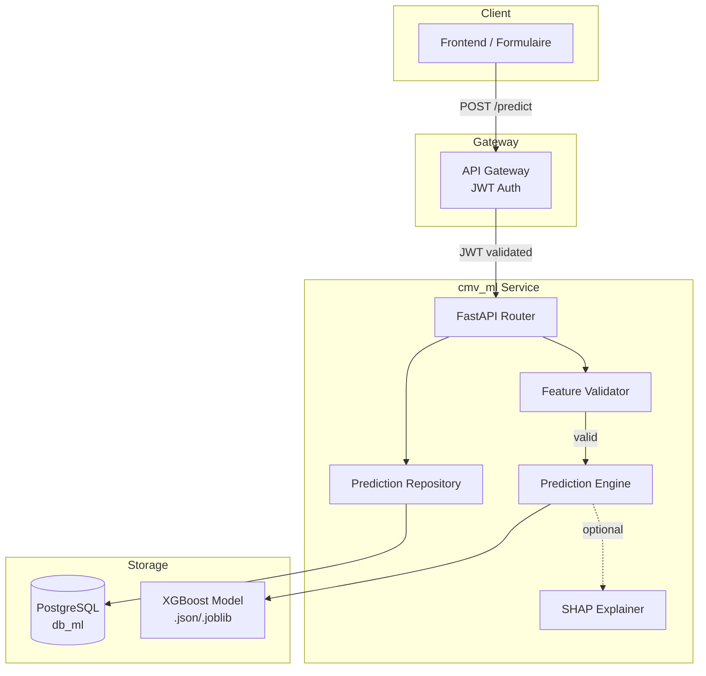
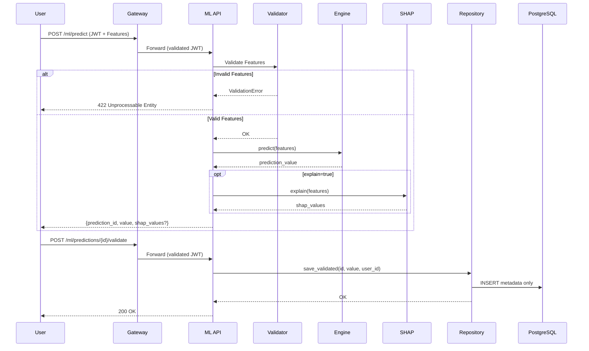

# Design Document: CMV ML Prediction Service

## Overview

Le microservice `cmv_ml` est un service FastAPI qui prédit la durée d'hospitalisation d'un patient à partir de 22 features médicales, en utilisant un modèle XGBoost pré-entraîné. Le service s'intègre dans l'architecture microservices existante et respecte les contraintes RGPD en ne persistant jamais les données médicales.

### Principes de conception

- **Stateless pour les données médicales** : Les features ne transitent qu'en mémoire
- **Cohérence architecturale** : Même structure que les services existants (patients, chambres)
- **Fail-fast** : Validation stricte des entrées et chargement du modèle au démarrage
- **Auditabilité** : Traçabilité des prédictions validées sans données sensibles

## Architecture



### Flux de données



## Components and Interfaces

### 1. Feature Validator (`app/validators/features.py`)

Responsable de la validation des 22 features d'entrée.

```python
from pydantic import BaseModel, Field, field_validator
from typing import Literal

class PredictionFeatures(BaseModel):
    """Schema de validation des features pour la prédiction."""
    
    # Genre (0=F, 1=M)
    gender: Literal[0, 1]
    
    # Comorbidités binaires (0/1)
    dialysisrenalendstage: Literal[0, 1]
    asthma: Literal[0, 1]
    irondef: Literal[0, 1]
    pneum: Literal[0, 1]
    substancedependence: Literal[0, 1]
    psychologicaldisordermajor: Literal[0, 1]
    depress: Literal[0, 1]
    psychother: Literal[0, 1]
    fibrosisandother: Literal[0, 1]
    malnutrition: Literal[0, 1]
    hemo: Literal[0, 1]
    
    # Variables continues
    hematocrit: float = Field(gt=0)
    neutrophils: float = Field(gt=0)
    sodium: float = Field(gt=0)
    glucose: float = Field(gt=0)
    bloodureanitro: float = Field(gt=0)
    creatinine: float = Field(gt=0)
    bmi: float = Field(gt=0)
    pulse: int = Field(gt=0)
    respiration: float = Field(gt=0)
    
    # Autres
    rcount: int = Field(ge=0)  # Nombre de visites précédentes
    secondarydiagnosisnonicd9: int = Field(ge=0)
```

### 2. Prediction Engine (`app/services/prediction_engine.py`)

Charge et exécute le modèle XGBoost.

```python
from typing import Protocol
import numpy as np

class PredictionEngineProtocol(Protocol):
    """Interface du moteur de prédiction."""
    
    def load_model(self, path: str) -> None:
        """Charge le modèle depuis un fichier."""
        ...
    
    def predict(self, features: dict) -> float:
        """Retourne la prédiction de durée d'hospitalisation."""
        ...
    
    def get_feature_order(self) -> list[str]:
        """Retourne l'ordre des features attendu par le modèle."""
        ...


class XGBoostPredictionEngine:
    """Implémentation avec XGBoost."""
    
    def __init__(self):
        self._model = None
        self._feature_order = [
            "gender", "dialysisrenalendstage", "asthma", "irondef", "pneum",
            "substancedependence", "psychologicaldisordermajor", "depress",
            "psychother", "fibrosisandother", "malnutrition", "hemo",
            "hematocrit", "neutrophils", "sodium", "glucose", "bloodureanitro",
            "creatinine", "bmi", "pulse", "respiration", "rcount",
            "secondarydiagnosisnonicd9"
        ]
    
    def load_model(self, path: str) -> None:
        """Charge le modèle XGBoost (.json ou .joblib)."""
        ...
    
    def predict(self, features: dict) -> float:
        """Exécute la prédiction."""
        ...
```

### 3. SHAP Explainer (`app/services/shap_explainer.py`)

Calcule l'explicabilité des prédictions (optionnel).

```python
from typing import Protocol

class ShapExplainerProtocol(Protocol):
    """Interface de l'explicateur SHAP."""
    
    def explain(self, features: dict) -> dict[str, float]:
        """Retourne les contributions SHAP par feature."""
        ...


class XGBoostShapExplainer:
    """Implémentation SHAP pour XGBoost."""
    
    def __init__(self, model):
        self._explainer = None
        self._model = model
    
    def explain(self, features: dict) -> dict[str, float]:
        """Calcule les valeurs SHAP pour une prédiction."""
        ...
```

### 4. Prediction Repository (`app/repositories/predictions_crud.py`)

Gère la persistance des métadonnées de prédictions validées.

```python
from typing import Protocol
from datetime import datetime
from uuid import UUID

class PredictionRepositoryProtocol(Protocol):
    """Interface du repository de prédictions."""
    
    def save_validated(
        self, 
        prediction_id: UUID, 
        predicted_value: float, 
        user_id: int,
        validation_date: datetime
    ) -> None:
        """Persiste une prédiction validée (métadonnées uniquement)."""
        ...
    
    def get_all(self, limit: int, offset: int) -> list[dict]:
        """Récupère l'historique des prédictions validées."""
        ...
    
    def exists(self, prediction_id: UUID) -> bool:
        """Vérifie si une prédiction existe."""
        ...
```

### 5. API Router (`app/routers/predictions.py`)

Expose les endpoints REST.

```python
from fastapi import APIRouter, Depends, HTTPException, Query
from uuid import UUID

router = APIRouter(prefix="/predictions", tags=["predictions"])

@router.post("/predict")
async def predict(
    features: PredictionFeatures,
    explain: bool = Query(False),
    current_user: dict = Depends(check_authorization)
) -> PredictionResponse:
    """
    Prédit la durée d'hospitalisation.
    
    ⚠️ RGPD: Les données médicales ne sont pas stockées.
    """
    ...

@router.post("/{prediction_id}/validate")
async def validate_prediction(
    prediction_id: UUID,
    current_user: dict = Depends(check_authorization)
) -> dict:
    """Valide une prédiction pour l'enregistrer dans l'historique."""
    ...

@router.get("/")
async def get_predictions(
    limit: int = Query(20, ge=1, le=100),
    offset: int = Query(0, ge=0),
    current_user: dict = Depends(check_authorization)
) -> PaginatedPredictions:
    """Récupère l'historique des prédictions validées."""
    ...
```

## Data Models

### Database Schema (PostgreSQL)

```sql
-- Table des prédictions validées (RGPD compliant - pas de features médicales)
CREATE TABLE validated_predictions (
    id UUID PRIMARY KEY,
    predicted_value FLOAT NOT NULL,
    validation_date TIMESTAMP WITH TIME ZONE NOT NULL DEFAULT NOW(),
    user_id INTEGER NOT NULL,
    created_at TIMESTAMP WITH TIME ZONE NOT NULL DEFAULT NOW()
);

CREATE INDEX idx_predictions_user_id ON validated_predictions(user_id);
CREATE INDEX idx_predictions_validation_date ON validated_predictions(validation_date);
```

### SQLAlchemy Model

```python
from sqlalchemy import Column, Float, Integer, DateTime
from sqlalchemy.dialects.postgresql import UUID
from datetime import datetime
import uuid

class ValidatedPrediction(Base):
    """Modèle SQLAlchemy pour les prédictions validées."""
    
    __tablename__ = "validated_predictions"
    
    id = Column(UUID(as_uuid=True), primary_key=True, default=uuid.uuid4)
    predicted_value = Column(Float, nullable=False)
    validation_date = Column(DateTime(timezone=True), nullable=False, default=datetime.utcnow)
    user_id = Column(Integer, nullable=False, index=True)
    created_at = Column(DateTime(timezone=True), nullable=False, default=datetime.utcnow)
```

### API Schemas (Pydantic)

```python
from pydantic import BaseModel
from datetime import datetime
from uuid import UUID

class PredictionResponse(BaseModel):
    """Réponse de l'endpoint /predict."""
    prediction_id: UUID
    predicted_length_of_stay: float
    shap_values: dict[str, float] | None = None

class ValidatedPredictionSchema(BaseModel):
    """Schema d'une prédiction validée."""
    id: UUID
    predicted_value: float
    validation_date: datetime
    user_id: int

class PaginatedPredictions(BaseModel):
    """Réponse paginée des prédictions."""
    items: list[ValidatedPredictionSchema]
    total: int
    limit: int
    offset: int
```

### In-Memory Prediction Cache

Pour permettre la validation d'une prédiction sans re-soumettre les features :

```python
from datetime import datetime, timedelta
from uuid import UUID

class PredictionCache:
    """Cache en mémoire des prédictions en attente de validation."""
    
    def __init__(self, ttl_minutes: int = 30):
        self._cache: dict[UUID, tuple[float, datetime]] = {}
        self._ttl = timedelta(minutes=ttl_minutes)
    
    def store(self, prediction_id: UUID, value: float) -> None:
        """Stocke une prédiction temporairement."""
        self._cache[prediction_id] = (value, datetime.utcnow())
    
    def get(self, prediction_id: UUID) -> float | None:
        """Récupère une prédiction si elle existe et n'est pas expirée."""
        if prediction_id not in self._cache:
            return None
        value, timestamp = self._cache[prediction_id]
        if datetime.utcnow() - timestamp > self._ttl:
            del self._cache[prediction_id]
            return None
        return value
    
    def remove(self, prediction_id: UUID) -> None:
        """Supprime une prédiction du cache."""
        self._cache.pop(prediction_id, None)
```


## Correctness Properties

*A property is a characteristic or behavior that should hold true across all valid executions of a system—essentially, a formal statement about what the system should do. Properties serve as the bridge between human-readable specifications and machine-verifiable correctness guarantees.*

### Property 1: Prediction Output Validity

*For any* valid set of 22 features (all fields present, binary fields in {0,1}, continuous fields positive), the Prediction_Engine SHALL return a positive float representing the predicted length of stay in days.

**Validates: Requirements 1.1**

### Property 2: Feature Validation Completeness

*For any* input missing at least one required field, OR containing a binary field with value outside {0,1}, OR containing a continuous field with non-positive value, the Feature_Validator SHALL reject the input with a 422 status code and a validation error message identifying the invalid field(s).

**Validates: Requirements 1.2, 1.3, 1.4, 1.5**

### Property 3: JWT User Extraction

*For any* valid JWT token containing a user_id in its payload, the ML_Service SHALL correctly extract and return the same user_id value.

**Validates: Requirements 2.3**

### Property 4: Prediction ID Uniqueness

*For any* sequence of N predictions generated by the ML_Service, all N prediction_ids SHALL be unique (no duplicates).

**Validates: Requirements 3.1**

### Property 5: Validation Round-Trip

*For any* prediction that is generated and then validated, calling GET /predictions SHALL return a record containing the exact same prediction_id and predicted_value that were returned during prediction.

**Validates: Requirements 3.2, 4.1**

### Property 6: Pagination Correctness

*For any* set of N validated predictions and any valid (limit, offset) pair where limit > 0 and offset >= 0, the GET /predictions endpoint SHALL return exactly min(limit, max(0, N - offset)) items, starting from the (offset + 1)th most recent prediction.

**Validates: Requirements 4.1, 4.3**

### Property 7: SHAP Feature Coverage

*For any* prediction request with explain=true when SHAP is enabled, the returned shap_values dictionary SHALL contain exactly 22 keys, one for each feature name in the model's feature set.

**Validates: Requirements 5.2**

## Error Handling

### HTTP Error Codes

| Code | Condition | Response Body |
|------|-----------|---------------|
| 400 | Malformed JSON request | `{"detail": "Invalid JSON"}` |
| 401 | Missing JWT token | `{"detail": "Not authenticated"}` |
| 403 | Invalid/expired JWT token | `{"detail": "not_authorized"}` |
| 404 | Prediction ID not found | `{"detail": "Prediction not found"}` |
| 422 | Feature validation failed | `{"detail": [{"loc": [...], "msg": "...", "type": "..."}]}` |
| 500 | Model inference error | `{"detail": "Prediction failed"}` |
| 503 | Model not loaded | `{"detail": "Service unavailable"}` |

### Error Handling Strategy

```python
from fastapi import HTTPException, status
from fastapi.responses import JSONResponse

class PredictionError(Exception):
    """Erreur lors de l'inférence du modèle."""
    pass

class ModelNotLoadedError(Exception):
    """Le modèle n'est pas chargé."""
    pass

# Gestionnaire global d'erreurs
@app.exception_handler(PredictionError)
async def prediction_error_handler(request, exc):
    return JSONResponse(
        status_code=status.HTTP_500_INTERNAL_SERVER_ERROR,
        content={"detail": "Prediction failed"}
    )

@app.exception_handler(ModelNotLoadedError)
async def model_not_loaded_handler(request, exc):
    return JSONResponse(
        status_code=status.HTTP_503_SERVICE_UNAVAILABLE,
        content={"detail": "Service unavailable"}
    )
```

### Startup Validation

```python
from contextlib import asynccontextmanager

@asynccontextmanager
async def lifespan(app: FastAPI):
    # Startup: charger le modèle
    try:
        prediction_engine.load_model(MODEL_PATH)
    except FileNotFoundError:
        raise RuntimeError(f"Model file not found: {MODEL_PATH}")
    except Exception as e:
        raise RuntimeError(f"Failed to load model: {e}")
    
    yield
    
    # Shutdown: cleanup si nécessaire
    pass
```

## Testing Strategy

### Dual Testing Approach

Le service utilise une approche de test combinée :

1. **Tests unitaires** : Cas spécifiques, edge cases, intégration
2. **Tests property-based** : Propriétés universelles avec Hypothesis

### Property-Based Testing Configuration

- **Bibliothèque** : Hypothesis (Python)
- **Minimum iterations** : 100 par propriété
- **Tag format** : `# Feature: cmv-ml-prediction, Property N: {property_text}`

### Test Structure

```
cmv_ml/
└── app/
    └── tests/
        ├── conftest.py           # Fixtures partagées
        ├── test_validators.py    # Tests de validation (Property 2)
        ├── test_prediction.py    # Tests de prédiction (Property 1, 4)
        ├── test_auth.py          # Tests JWT (Property 3)
        ├── test_repository.py    # Tests persistence (Property 5)
        ├── test_pagination.py    # Tests pagination (Property 6)
        └── test_shap.py          # Tests SHAP (Property 7)
```

### Hypothesis Generators

```python
from hypothesis import given, strategies as st, settings

# Générateur de features valides
valid_features = st.fixed_dictionaries({
    "gender": st.integers(min_value=0, max_value=1),
    "dialysisrenalendstage": st.integers(min_value=0, max_value=1),
    "asthma": st.integers(min_value=0, max_value=1),
    "irondef": st.integers(min_value=0, max_value=1),
    "pneum": st.integers(min_value=0, max_value=1),
    "substancedependence": st.integers(min_value=0, max_value=1),
    "psychologicaldisordermajor": st.integers(min_value=0, max_value=1),
    "depress": st.integers(min_value=0, max_value=1),
    "psychother": st.integers(min_value=0, max_value=1),
    "fibrosisandother": st.integers(min_value=0, max_value=1),
    "malnutrition": st.integers(min_value=0, max_value=1),
    "hemo": st.integers(min_value=0, max_value=1),
    "hematocrit": st.floats(min_value=0.1, max_value=100.0),
    "neutrophils": st.floats(min_value=0.1, max_value=100.0),
    "sodium": st.floats(min_value=100.0, max_value=200.0),
    "glucose": st.floats(min_value=50.0, max_value=500.0),
    "bloodureanitro": st.floats(min_value=1.0, max_value=100.0),
    "creatinine": st.floats(min_value=0.1, max_value=20.0),
    "bmi": st.floats(min_value=10.0, max_value=60.0),
    "pulse": st.integers(min_value=30, max_value=200),
    "respiration": st.floats(min_value=5.0, max_value=40.0),
    "rcount": st.integers(min_value=0, max_value=10),
    "secondarydiagnosisnonicd9": st.integers(min_value=0, max_value=10),
})

# Générateur de features invalides (champ manquant)
def features_with_missing_field():
    return valid_features.flatmap(
        lambda f: st.sampled_from(list(f.keys())).map(
            lambda k: {key: val for key, val in f.items() if key != k}
        )
    )
```

### Example Property Test

```python
from hypothesis import given, settings
import pytest

# Feature: cmv-ml-prediction, Property 1: Prediction Output Validity
@given(features=valid_features)
@settings(max_examples=100)
def test_prediction_returns_positive_value(features, prediction_engine):
    """
    For any valid set of features, the prediction should be a positive float.
    """
    result = prediction_engine.predict(features)
    assert isinstance(result, float)
    assert result > 0
```

### Unit Test Examples

```python
# Test d'authentification (exemple spécifique)
def test_missing_token_returns_401(client):
    response = client.post("/predictions/predict", json=valid_features_example)
    assert response.status_code == 401

# Test de validation non-existante (exemple spécifique)
def test_validate_nonexistent_prediction_returns_404(client, auth_headers):
    fake_id = "00000000-0000-0000-0000-000000000000"
    response = client.post(f"/predictions/{fake_id}/validate", headers=auth_headers)
    assert response.status_code == 404
```
