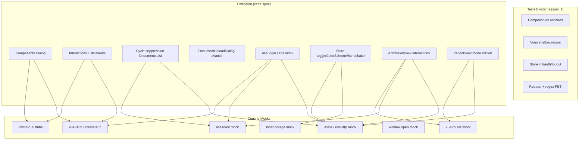

# Document de Conception — Extension de la Couverture de Tests Frontend

## Vue d'ensemble

Ce document décrit la conception des tests unitaires complémentaires pour le frontend Vue.js du projet CMV Healthcare. Cette extension cible les fichiers dont la couverture reste insuffisante après la première vague de tests (spec `frontend-test-coverage`) : les composants de dialogue (DeletePatientDialog, DeleteConfirmationDialog, DocumentPatient), les interactions avancées des composants de liste (ListPatients, DocumentsList, DocumentUploadDialog), le composable useLogin testé sans mock, les fonctions manquantes du store utilisateur (toggleColorScheme, updateColorScheme, handshake), et les interactions avancées des vues AdmissionView et PatientView.

La pile de test reste identique : Vitest (runner), @vue/test-utils (montage), happy-dom (DOM), @pinia/testing (store), fast-check (property-based). Les tests sont placés dans `cmv_gateway/cmv_front/src/tests/`.

## Architecture



### Principes architecturaux

1. **Continuité avec la spec 1** : mêmes patterns de mock (useHttp, vue-router, useToast, vue-i18n), mêmes conventions de nommage
2. **Tests de composants avec mount réel** : pour les composants de dialogue et de liste, on utilise `mount` (pas `shallowMount`) avec des stubs PrimeVue afin de tester les interactions réelles (clics, émissions)
3. **useLogin sans mock du composable** : contrairement au test existant qui mocke useLogin lui-même, on teste la logique réelle en mockant uniquement useHttp et les dépendances externes
4. **Isolation DOM** : pour toggleColorScheme, on manipule `document.querySelector('html')` dans happy-dom et on mocke localStorage

## Composants et Interfaces

### Stratégie de mock par composant

#### Composants Dialog (Exigences 1, 2, 3)

Les composants DeletePatientDialog, DeleteConfirmationDialog et DocumentPatient sont montés avec `mount` et des stubs PrimeVue :

```typescript
// Stubs PrimeVue pour les dialogues
const stubs = {
  Dialog: {
    template: '<div class="dialog" v-if="visible"><slot /><slot name="footer" /></div>',
    props: ['visible', 'header']
  },
  Button: {
    template: '<button @click="$emit(\'click\')" :disabled="disabled" :loading="loading"><slot />{{ label }}</button>',
    props: ['label', 'severity', 'loading', 'disabled', 'fluid', 'icon', 'text', 'rounded', 'variant', 'outlined', 'size']
  },
  Card: {
    template: '<div class="card"><slot name="title"/><slot name="subtitle"/><slot name="content"/><slot name="footer"/></div>'
  }
}
```

#### ListPatients avancé (Exigence 4)

Le composant ListPatients utilise un DataTable stubé avec un template plus complet permettant de tester les interactions :

```typescript
// DataTable stub avec header, body et empty slots
const DataTableStub = {
  template: `
    <div class="datatable">
      <slot name="header" />
      <div v-if="value && value.length > 0">
        <slot />
      </div>
      <slot v-else name="empty" />
    </div>
  `,
  props: ['value', 'loading', 'totalRecords', 'lazy']
}
```

#### useLogin réel (Exigence 7)

On mocke useHttp au niveau module mais on laisse useLogin s'exécuter réellement :

```typescript
const mockSendRequest = vi.fn()
vi.mock('@/composables/useHttp', () => ({
  default: () => ({
    sendRequest: mockSendRequest,
    isLoading: ref(false),
    error: ref(null)
  })
}))
// useLogin n'est PAS mocké — on teste sa logique réelle
```

#### Store toggleColorScheme (Exigence 8)

On utilise `createTestingPinia({ stubActions: false })` et on manipule le DOM happy-dom :

```typescript
// Manipulation directe du DOM pour tester toggleColorScheme
const htmlElement = document.querySelector('html')
// localStorage est disponible nativement dans happy-dom
```

### Organisation des fichiers de test

```
cmv_gateway/cmv_front/src/tests/
├── DeletePatientDialog.spec.ts       # Exigence 1 (nouveau)
├── DeleteConfirmationDialog.spec.ts  # Exigence 2 (nouveau)
├── DocumentPatient.spec.ts           # Exigence 3 (nouveau)
├── ListPatients.spec.ts              # Exigence 4 (extension)
├── DocumentsList.spec.ts             # Exigence 5 (extension)
├── DocumentUploadDialog.spec.ts      # Exigence 6 (extension)
├── UseLogin.spec.ts                  # Exigence 7 (réécriture)
├── UserStore.spec.ts                 # Exigence 8 (extension)
├── BusinessViews.spec.ts             # Exigences 9, 10 (extension)
└── ... (fichiers existants inchangés)
```

## Modèles de Données

### Structures utilisées dans les tests

```typescript
// Patient pour DeletePatientDialog
interface PatientsListItem {
  id_patient: number
  prenom: string
  nom: string
  date_de_naissance: string
  telephone: string
  email?: string
}

// Document pour DeleteConfirmationDialog et DocumentPatient
interface Document {
  id_document: number
  nom_fichier: string
  type_document: string
  created_at: string
}

// Credentials pour useLogin
interface Credentials {
  username: string
  password: string
}
```

### Fixtures de test

```typescript
const createMockPatient = (overrides = {}): PatientsListItem => ({
  id_patient: 1,
  nom: 'Dupont',
  prenom: 'Jean',
  date_de_naissance: '1990-01-15',
  telephone: '0123456789',
  ...overrides
})

const createMockDocument = (overrides = {}): Document => ({
  id_document: 1,
  nom_fichier: 'test.pdf',
  type_document: 'authorization_for_care',
  created_at: '2024-01-15T10:00:00.000Z',
  ...overrides
})
```


## Propriétés de Correction

*Une propriété est une caractéristique ou un comportement qui doit rester vrai pour toutes les exécutions valides d'un système — essentiellement, une déclaration formelle de ce que le système doit faire. Les propriétés servent de pont entre les spécifications lisibles par l'humain et les garanties de correction vérifiables par la machine.*

La majorité des critères d'acceptation de cette spec concerne des interactions UI spécifiques (clics, émissions, rendu conditionnel) qui sont mieux couvertes par des tests unitaires avec des exemples concrets. Trois propriétés universelles ont été identifiées :

### Propriété 1 : URL de téléchargement contient l'identifiant du document

*Pour tout* identifiant de document (nombre entier positif), lorsque l'utilisateur clique sur le bouton de téléchargement de DocumentPatient, `window.open` doit être appelé avec une URL contenant cet identifiant.

**Valide : Exigences 3.2**

### Propriété 2 : Émission de suppression contient l'identifiant du document

*Pour tout* identifiant de document (nombre entier positif), lorsque l'utilisateur clique sur le bouton de suppression de DocumentPatient, l'événement "delete-document" émis doit contenir exactement cet identifiant.

**Valide : Exigences 3.3**

### Propriété 3 : Arithmétique de date pour l'application de la prédiction

*Pour tout* nombre entier positif de jours prédit et toute date d'entrée valide, lorsque l'utilisateur applique la prédiction dans AdmissionView, la date de sortie résultante doit être exactement égale à la date d'entrée plus le nombre de jours prédit.

**Valide : Exigences 9.4**

## Gestion des Erreurs

### Scénarios d'erreur testés

| Scénario | Comportement attendu | Fichier de test |
|---|---|---|
| Connexion échouée (error non null) | Toast d'erreur avec message de connexion échouée | UseLogin.spec.ts |
| Email invalide dans loginFormSchema | Rejet par la validation Zod | UseLogin.spec.ts |
| Mot de passe non conforme dans loginFormSchema | Rejet par la validation Zod | UseLogin.spec.ts |
| Soumission admission échouée | Toast d'erreur avec le message d'erreur | BusinessViews.spec.ts |
| Document null dans DeleteConfirmationDialog | Bloc type de document masqué | DeleteConfirmationDialog.spec.ts |
| detailPatient null dans PatientView | Sections PatientDetail, DocumentsList, DocumentUpload non rendues | BusinessViews.spec.ts |

## Stratégie de Test

### Approche duale

1. **Tests unitaires** (Vitest + @vue/test-utils) : couvrent la grande majorité des critères — interactions UI, émissions, rendu conditionnel, états de chargement, gestion d'erreurs. C'est le cœur de cette spec.

2. **Tests property-based** (fast-check) : couvrent les 3 propriétés identifiées — propagation d'identifiants de document et arithmétique de dates.

### Bibliothèque property-based

- **Bibliothèque** : `fast-check` (déjà installé)
- **Configuration** : minimum 100 itérations par test property-based
- **Intégration** : `fc.assert(fc.property(...))` dans Vitest

### Convention de tagging

```typescript
// Feature: frontend-coverage-extension, Property 1: URL de téléchargement contient l'identifiant du document
it('should call window.open with URL containing document ID for any ID', () => {
  fc.assert(
    fc.property(fc.integer({ min: 1, max: 100000 }), (docId) => {
      // ...
    }),
    { numRuns: 100 }
  )
})
```

### Répartition tests unitaires vs property-based

| Fichier de test | Tests unitaires | Tests property-based |
|---|---|---|
| DeletePatientDialog.spec.ts | Rendu patient, émissions confirm/cancel/close | — |
| DeleteConfirmationDialog.spec.ts | Rendu type document, émissions, loading, document null | — |
| DocumentPatient.spec.ts | Rendu index/date/type | Propriétés 1, 2 |
| ListPatients.spec.ts | Liste vide, recherche, reset, suppression, dialogue | — |
| DocumentsList.spec.ts | Cycle suppression, confirmation, annulation | — |
| DocumentUploadDialog.spec.ts | Bouton désactivé, suppression fichier, soumission | — |
| UseLogin.spec.ts | Init, sendRequest args, getUserInfos, toast erreur, validation schema | — |
| UserStore.spec.ts | toggleColorScheme light→dark/dark→light, updateColorScheme, handshake | — |
| BusinessViews.spec.ts (AdmissionView) | Soumission admission, toast succès, prédiction, toast erreur, annuler | Propriété 3 |
| BusinessViews.spec.ts (PatientView) | fetchPatientData, mode édition, retour lecture, toggleVisible, null state | — |

### Exécution

```bash
cd cmv_gateway/cmv_front && npx vitest --run
```
