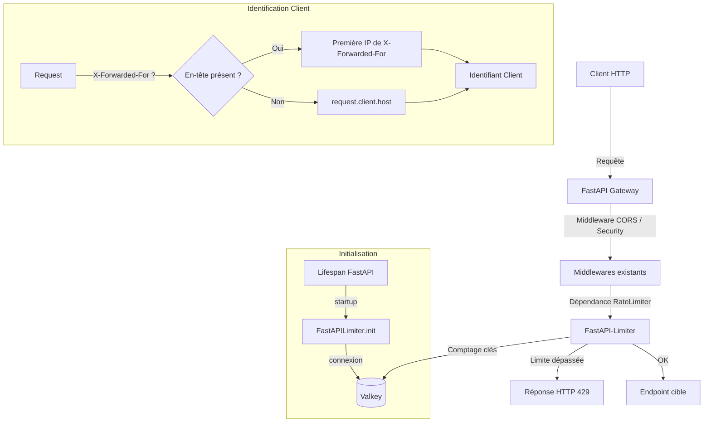
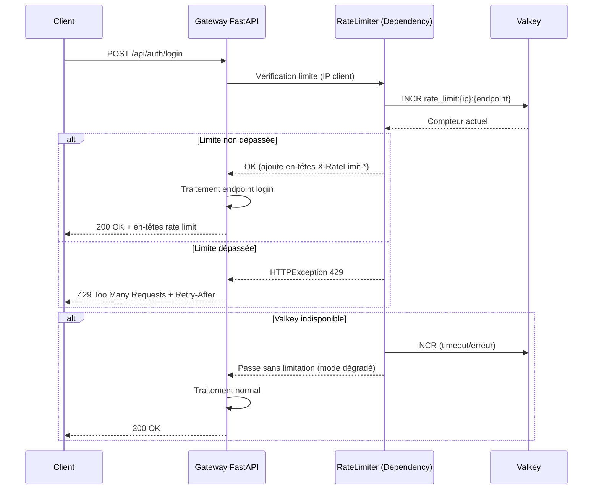

# Document de Design — Rate Limiting sur la Gateway

## Vue d'ensemble

Ce design décrit l'implémentation du rate limiting sur la gateway FastAPI (`cmv_gateway/cmv_back`) en utilisant la bibliothèque `fastapi-limiter` (déjà présente dans les dépendances) avec Valkey comme backend de comptage. L'objectif principal est de protéger le endpoint de connexion `/api/auth/login` contre les attaques par force brute, puis d'appliquer une limite globale sur tous les endpoints `/api`.

Le rate limiter s'intègre dans l'architecture existante via le cycle de vie (`lifespan`) de FastAPI et utilise le client Redis asynchrone déjà configuré dans `app/dependancies/redis.py`. Le design privilégie la résilience : en cas d'indisponibilité de Valkey, la gateway continue de fonctionner sans rate limiting (mode dégradé).

### Décisions de design clés

1. **`fastapi-limiter` comme bibliothèque** : Déjà en dépendance, elle fournit un décorateur `@RateLimiter` compatible avec FastAPI et un backend Redis/Valkey natif.
2. **Identification par IP** : Le rate limiter identifie les clients par leur adresse IP, en tenant compte de `X-Forwarded-For` pour les déploiements derrière un reverse proxy.
3. **Mode dégradé gracieux** : Si Valkey est indisponible, les requêtes passent sans limitation plutôt que d'être bloquées.
4. **Deux niveaux de limitation** : Une limite stricte sur `/api/auth/login` (5 req/60s) et une limite globale sur `/api/*` (60 req/60s).

## Architecture



### Flux de traitement d'une requête



## Composants et Interfaces

### 1. Fonction d'identification client (`custom_identifier`)

**Fichier** : `cmv_gateway/cmv_back/app/utils/rate_limiter.py`

```python
async def custom_identifier(request: Request) -> str:
```

- Extrait l'IP client depuis `X-Forwarded-For` (première IP) ou `request.client.host`
- Retourne une clé de fallback `"unknown"` si l'IP ne peut être déterminée, avec journalisation d'un avertissement
- Utilisée comme callback `identifier` dans `FastAPILimiter.init()`

### 2. Callback HTTP 429 (`custom_callback`)

**Fichier** : `cmv_gateway/cmv_back/app/utils/rate_limiter.py`

```python
async def custom_callback(request: Request, response: Response, pexpire: int):
```

- Appelée par `fastapi-limiter` quand la limite est dépassée
- Calcule le `Retry-After` en secondes depuis `pexpire` (millisecondes)
- Lève une `HTTPException(429)` avec :
  - Corps JSON : `{"detail": "Trop de requêtes. Réessayez dans X secondes."}`
  - En-têtes : `Retry-After`, `X-RateLimit-Limit`, `X-RateLimit-Remaining` (0), `X-RateLimit-Reset`

### 3. Initialisation du Rate Limiter (`init_rate_limiter`)

**Fichier** : `cmv_gateway/cmv_back/app/utils/rate_limiter.py`

```python
async def init_rate_limiter() -> bool:
```

- Crée un client Redis asynchrone vers `redis://{VALKEY_HOST}:{VALKEY_PORT}`
- Appelle `FastAPILimiter.init()` avec le client, l'identifier et le callback
- Retourne `True` si l'initialisation réussit, `False` sinon
- En cas d'échec de connexion, journalise l'erreur et permet le démarrage en mode dégradé

### 4. Fermeture du Rate Limiter (`close_rate_limiter`)

**Fichier** : `cmv_gateway/cmv_back/app/utils/rate_limiter.py`

```python
async def close_rate_limiter():
```

- Ferme proprement la connexion Redis au shutdown de l'application
- Appelée dans le `lifespan` de FastAPI

### 5. Intégration Lifespan dans `main.py`

Modification du `main.py` existant pour ajouter un `lifespan` context manager :

```python
@asynccontextmanager
async def lifespan(app: FastAPI):
    await init_rate_limiter()
    yield
    await close_rate_limiter()
```

L'application FastAPI est créée avec `FastAPI(lifespan=lifespan)`.

### 6. Décorateurs sur les endpoints

- **Login** (`/api/auth/login`) : `Depends(RateLimiter(times=5, seconds=60))`
- **Endpoints globaux** : Le rate limiter global (60 req/60s) est appliqué via une dépendance au niveau du routeur `/api` : `dependencies=[Depends(RateLimiter(times=60, seconds=60))]`
- Les limites spécifiques par endpoint (comme login) prennent priorité sur la limite globale car elles sont évaluées en premier au niveau du endpoint.

## Modèles de données

### Clés Valkey

Le rate limiter utilise des clés Valkey gérées par `fastapi-limiter` avec le format interne suivant :

| Clé | Format | TTL | Description |
|-----|--------|-----|-------------|
| Rate limit par endpoint | `fastapi-limiter:{identifier}:{path}` | Fenêtre temporelle (60s) | Compteur de requêtes par IP et par endpoint |

### Réponse HTTP 429

```json
{
  "detail": "Trop de requêtes. Réessayez dans 45 secondes."
}
```

En-têtes de réponse :

| En-tête | Type | Description |
|---------|------|-------------|
| `Retry-After` | `int` | Secondes restantes avant réinitialisation de la fenêtre |
| `X-RateLimit-Limit` | `int` | Nombre maximum de requêtes autorisées dans la fenêtre |
| `X-RateLimit-Remaining` | `int` | Nombre de requêtes restantes (0 quand limité) |
| `X-RateLimit-Reset` | `int` | Timestamp Unix de réinitialisation de la fenêtre |

### Configuration

Les paramètres de rate limiting sont définis comme constantes dans `rate_limiter.py` :

| Paramètre | Valeur | Description |
|-----------|--------|-------------|
| `LOGIN_RATE_LIMIT_TIMES` | `5` | Requêtes max sur login par fenêtre |
| `LOGIN_RATE_LIMIT_SECONDS` | `60` | Durée de la fenêtre login (secondes) |
| `GLOBAL_RATE_LIMIT_TIMES` | `60` | Requêtes max globales par fenêtre |
| `GLOBAL_RATE_LIMIT_SECONDS` | `60` | Durée de la fenêtre globale (secondes) |


## Propriétés de Correction

*Une propriété est une caractéristique ou un comportement qui doit rester vrai pour toutes les exécutions valides d'un système — essentiellement, une déclaration formelle de ce que le système doit faire. Les propriétés servent de pont entre les spécifications lisibles par l'humain et les garanties de correction vérifiables par la machine.*

### Propriété 1 : Limitation stricte du endpoint login

*Pour toute* adresse IP et *pour tout* nombre N de requêtes envoyées sur `/api/auth/login` dans une fenêtre de 60 secondes, si N > 5, alors les requêtes au-delà de la 5ème doivent retourner un code HTTP 429 avec un en-tête `Retry-After` contenant une valeur numérique positive.

**Valide : Exigences 2.1, 2.2, 2.3**

### Propriété 2 : Limitation globale des endpoints API

*Pour toute* adresse IP et *pour tout* endpoint sous le préfixe `/api` (hors limites spécifiques), si le nombre de requêtes dépasse 60 dans une fenêtre de 60 secondes, alors les requêtes excédentaires doivent retourner un code HTTP 429.

**Valide : Exigences 3.1, 3.2**

### Propriété 3 : Priorité des limites spécifiques sur la limite globale

*Pour tout* endpoint ayant une limite spécifique (ex: login à 5 req/60s), cette limite doit s'appliquer indépendamment de la limite globale (60 req/60s). Un client atteignant la limite spécifique de login doit être bloqué sur login même s'il n'a pas atteint la limite globale.

**Valide : Exigences 3.3**

### Propriété 4 : Format de la réponse 429

*Pour toute* requête rejetée par le rate limiter, la réponse HTTP 429 doit contenir un corps JSON avec un champ `detail` non vide, et les en-têtes `X-RateLimit-Limit`, `X-RateLimit-Remaining` et `X-RateLimit-Reset` doivent être présents avec des valeurs numériques.

**Valide : Exigences 4.1, 4.2**

### Propriété 5 : Identification client par IP

*Pour toute* requête HTTP, si l'en-tête `X-Forwarded-For` est présent avec une liste d'IPs, l'identifiant client utilisé pour le rate limiting doit être la première IP de cette liste. Si l'en-tête est absent, l'identifiant doit être `request.client.host`.

**Valide : Exigences 6.1, 6.2**

## Gestion des erreurs

### Indisponibilité de Valkey au démarrage (Exigence 1.3)

- `init_rate_limiter()` capture les exceptions de connexion Redis (`ConnectionError`, `TimeoutError`)
- Journalise l'erreur via le logger existant (`LoggerSetup`)
- Retourne `False` pour indiquer le mode dégradé
- La gateway démarre normalement, les dépendances `RateLimiter` sont rendues inopérantes (no-op)

### Indisponibilité de Valkey en cours d'exécution (Exigences 5.1, 5.2, 5.3)

- Le callback `custom_callback` et l'identifier `custom_identifier` sont wrappés dans des blocs try/except
- En cas d'erreur Redis, la requête passe sans limitation (fail-open)
- Un avertissement est journalisé à chaque erreur de connexion
- Quand Valkey redevient disponible, `fastapi-limiter` reprend automatiquement le comptage car il utilise le client Redis à chaque requête (pas de cache local)

### IP client indéterminée (Exigence 6.3)

- Si `request.client` est `None` et `X-Forwarded-For` est absent
- La fonction `custom_identifier` retourne `"unknown"` comme clé de fallback
- Un avertissement est journalisé
- Le rate limiting s'applique avec cette clé partagée (tous les clients non identifiés partagent le même compteur)

### Erreurs HTTP 429 (Exigence 4.3)

- Le handler d'exceptions existant dans `main.py` exclut déjà les 429 du logging (`if exc.status_code != 429`)
- Aucune modification nécessaire sur ce point

## Stratégie de tests

### Bibliothèque de tests par propriétés

- **Hypothesis** (déjà utilisée dans le projet, cf. `test_valkey_properties.py`)
- **fakeredis** pour simuler Valkey dans les tests
- Minimum 100 itérations par test de propriété (`@settings(max_examples=100)`)

### Tests unitaires

Les tests unitaires couvrent les cas spécifiques et les edge cases :

1. **Initialisation** : Vérifier que `init_rate_limiter` se connecte avec les bons paramètres (Exigence 1.1, 1.2)
2. **Mode dégradé au démarrage** : Vérifier que la gateway démarre si Valkey est down (Exigence 1.3)
3. **Non-journalisation des 429** : Vérifier que le handler existant n'enregistre pas les 429 (Exigence 4.3)
4. **Résilience Valkey** : Simuler une panne Valkey en cours d'exécution et vérifier le mode dégradé (Exigences 5.1, 5.2)
5. **Reprise après panne** : Simuler panne puis retour de Valkey (Exigence 5.3)
6. **Fallback IP inconnue** : Tester avec `request.client = None` et sans `X-Forwarded-For` (Exigence 6.3)

### Tests par propriétés

Chaque propriété de correction est implémentée par un seul test Hypothesis :

| Test | Propriété | Tag |
|------|-----------|-----|
| `test_login_rate_limit` | Propriété 1 | Feature: gateway-rate-limiter, Property 1: Limitation stricte du endpoint login |
| `test_global_rate_limit` | Propriété 2 | Feature: gateway-rate-limiter, Property 2: Limitation globale des endpoints API |
| `test_specific_limit_priority` | Propriété 3 | Feature: gateway-rate-limiter, Property 3: Priorité des limites spécifiques |
| `test_429_response_format` | Propriété 4 | Feature: gateway-rate-limiter, Property 4: Format de la réponse 429 |
| `test_client_identification` | Propriété 5 | Feature: gateway-rate-limiter, Property 5: Identification client par IP |

### Organisation des fichiers de test

- `cmv_gateway/cmv_back/app/tests/test_rate_limiter.py` : Tests unitaires et tests par propriétés
- Utilisation de `fakeredis.aioredis.FakeRedis` pour simuler Valkey (pattern existant dans le projet)
- Les fixtures existantes dans `conftest.py` sont réutilisées (`ac`, `mock_redis`, etc.)
