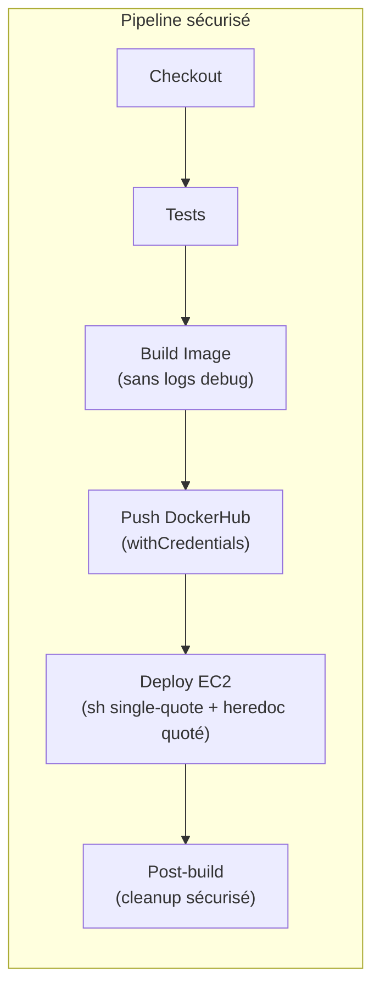

# Document de Conception — Sécurité des Pipelines Jenkins

## Vue d'ensemble (Overview)

Ce document décrit la conception technique pour le renforcement de la sécurité des 8 pipelines Jenkins du projet CMV. L'analyse des Jenkinsfiles existants révèle des vulnérabilités récurrentes :

- **Interpolation Groovy de secrets** : Les étapes `sh """..."""` utilisent `${VAR}` (Groovy) au lieu de `$VAR` (shell), exposant les secrets dans les logs Jenkins.
- **Logs verbeux** : Des commandes de debug (`docker --version`, `pwd`, `ls -la`) et des echo redondants polluent les logs.
- **SSH non sécurisé** : Les variables d'hôte/utilisateur sont interpolées par Groovy dans les commandes SSH, et certains heredocs ne sont pas quotés.
- **Secrets globaux** : Les credentials sont déclarés dans le bloc `environment` global, exposant les secrets à toutes les étapes.
- **Post-build fragile** : Le `docker logout` est encapsulé dans un bloc `node {}` redondant.

### Fichiers concernés

| Jenkinsfile | Déploiement | SSH Jump Host | Problèmes identifiés |
|---|---|---|---|
| Jenkins-gateway | Direct EC2 | Non | Interpolation Groovy, heredoc non quoté, logs verbeux |
| Jenkins-gateway-cdk | Direct EC2 | Non | Idem Jenkins-gateway |
| Jenkins-ml | Direct EC2 | Non | Interpolation Groovy, heredoc quoté mais `sh """` |
| Jenkins-ml-cdk | Via bastion | Oui (`-J`) | Interpolation Groovy dans SSH, heredoc quoté mais `sh """` |
| Jenkins-chambres | Via bastion | Oui (`-J`) | Interpolation Groovy, heredoc quoté mais `sh """` |
| Jenkins-chambres-cdk | Via bastion | Oui (`-J`) | Idem Jenkins-chambres |
| Jenkins-patients | Via bastion | Oui (`-J`) | Interpolation Groovy, heredoc quoté mais `sh """` |
| Jenkinsfile-gateway-exemple | Direct EC2 | Non | Interpolation Groovy, heredoc non quoté |

### Résumé des vulnérabilités par catégorie

```mermaid
graph TD
    A[Vulnérabilités identifiées] --> B[Interpolation Groovy]
    A --> C[Logs verbeux]
    A --> D[SSH non sécurisé]
    A --> E[Secrets globaux]
    A --> F[Post-build fragile]
    
    B --> B1["sh \"\"\" avec \${VAR} → expose secrets"]
    B --> B2["docker push \${IMAGE} → expose nom image"]
    
    D --> D1["Heredoc non quoté << EOF"]
    D --> D2["Variables hôte interpolées par Groovy"]
    
    E --> E1["credentials() dans environment global"]
    
    F --> F1["node {} redondant dans post.always"]
```

## Architecture

L'architecture de correction suit un pattern uniforme applicable à tous les Jenkinsfiles. Chaque pipeline conserve sa structure fonctionnelle (Checkout → Build → Push → Deploy → Post) mais avec des modifications de sécurité transversales.

### Pattern de pipeline sécurisé



### Décisions de conception

1. **Single-quotes pour toutes les étapes `sh` contenant des secrets** : On utilise `sh '...'` au lieu de `sh "..."` pour empêcher l'interpolation Groovy. Les variables sont résolues par le shell via `$VAR`.

2. **`withCredentials` scoped** : Les credentials DockerHub sont déplacés du bloc `environment` global vers des blocs `withCredentials` locaux aux stages Push et Deploy uniquement.

3. **Heredoc quoté (`<< 'EOF'`)** : Tous les heredocs SSH utilisent `<< 'EOF'` pour empêcher l'interpolation côté Jenkins. Les variables d'image Docker sont passées via `export` au début du heredoc.

4. **`set +x` dans les blocs shell sensibles** : Désactive le mode trace pour éviter l'affichage des commandes contenant des secrets.

5. **Suppression du bloc `node {}` dans post** : Le pipeline utilise déjà `agent any`, donc le `node {}` est redondant et peut causer des problèmes d'allocation d'agent.


## Composants et Interfaces (Components and Interfaces)

### Composant 1 : Bloc `withCredentials` pour DockerHub

Remplace la déclaration globale `DOCKERHUB_CREDENTIALS = credentials('cmv-dockerhub')` dans le bloc `environment`.

**Avant (vulnérable) :**
```groovy
environment {
    DOCKERHUB_CREDENTIALS = credentials('cmv-dockerhub')
    // ... autres variables
}

// Plus loin dans le pipeline :
stage('Push to DockerHub') {
    steps {
        sh 'echo $DOCKERHUB_CREDENTIALS_PSW | docker login -u $DOCKERHUB_CREDENTIALS_USR --password-stdin'
        sh "docker push ${IMAGE_GATEWAY}:latest"  // ← Interpolation Groovy
    }
}
```

**Après (sécurisé) :**
```groovy
environment {
    // Plus de DOCKERHUB_CREDENTIALS ici
    IMAGE_GATEWAY = "firizgoude/cmv_gateway"
    // ... variables non-sensibles uniquement
}

stage('Push to DockerHub') {
    steps {
        withCredentials([usernamePassword(
            credentialsId: 'cmv-dockerhub',
            usernameVariable: 'DOCKER_USER',
            passwordVariable: 'DOCKER_PASS'
        )]) {
            sh '''
                set +x
                echo "$DOCKER_PASS" | docker login --quiet -u "$DOCKER_USER" --password-stdin
                docker push "$IMAGE_GATEWAY:latest"
            '''
        }
    }
}
```

### Composant 2 : Bloc SSH sécurisé (déploiement direct)

Pour les pipelines sans jump host (Jenkins-gateway, Jenkins-gateway-cdk, Jenkins-ml).

**Avant (vulnérable) :**
```groovy
sshagent(credentials: ['cmv-ssh-key']) {
    sh """
        ssh -o StrictHostKeyChecking=no \
            -o UserKnownHostsFile=/dev/null \
            -o LogLevel=ERROR \
            ${EC2_USER}@${EC2_HOST} << EOF
        
        IMAGE_NAME=${IMAGE_GATEWAY}
        ${remoteCommands}
EOF
    """
}
```

**Après (sécurisé) :**
```groovy
sshagent(credentials: ['cmv-ssh-key']) {
    sh '''
        set +x
        ssh -o StrictHostKeyChecking=no \
            -o UserKnownHostsFile=/dev/null \
            -o LogLevel=ERROR \
            $EC2_USER@$EC2_HOST << 'EOF'

        docker stop cmv_gateway || true
        docker rm cmv_gateway || true
        docker image rm "$IMAGE_GATEWAY:latest" || true
        docker network create cmv || true
        docker compose up -d
EOF
    '''
}
```

### Composant 3 : Bloc SSH sécurisé (déploiement via bastion / jump host)

Pour les pipelines avec rebond SSH (Jenkins-chambres, Jenkins-chambres-cdk, Jenkins-patients, Jenkins-ml-cdk).

**Avant (vulnérable) :**
```groovy
sshagent(credentials: ['cdk-key']) {
    sh """
        ssh -o StrictHostKeyChecking=no \
            -o UserKnownHostsFile=/dev/null \
            -o LogLevel=ERROR \
            -A \
            -J ${GATEWAY_USER}@${GATEWAY_HOST} \
            ${CHAMBRES_USER}@${CHAMBRES_HOST} << 'EOF'

# Login DockerHub sur l'EC2
echo "${DOCKERHUB_CREDENTIALS_PSW}" | docker login -u ${DOCKERHUB_CREDENTIALS_USR} --password-stdin
# ...
EOF
    """
}
```

**Après (sécurisé) :**
```groovy
withCredentials([usernamePassword(
    credentialsId: 'cmv-dockerhub',
    usernameVariable: 'DOCKER_USER',
    passwordVariable: 'DOCKER_PASS'
)]) {
    sshagent(credentials: ['cdk-key']) {
        sh '''
            set +x
            ssh -o StrictHostKeyChecking=no \
                -o UserKnownHostsFile=/dev/null \
                -o LogLevel=ERROR \
                -A \
                -J $GATEWAY_USER@$GATEWAY_HOST \
                $CHAMBRES_USER@$CHAMBRES_HOST << 'EOF'

echo "$DOCKER_PASS" | docker login --quiet -u "$DOCKER_USER" --password-stdin

docker stop cmv_chambres || true
docker rm cmv_chambres || true
docker image rm "$IMAGE_CHAMBRES:latest" || true

docker compose up -d

docker logout
EOF
        '''
    }
}
```

**Note importante** : Avec `sh '''...'''` (single-quotes Groovy), les variables `$GATEWAY_USER`, `$GATEWAY_HOST`, etc. sont résolues par le shell à partir des variables d'environnement Jenkins, pas par Groovy. Le heredoc `<< 'EOF'` empêche ensuite l'expansion côté shell local, laissant les variables être résolues sur le serveur distant. Les variables comme `$DOCKER_USER` et `$DOCKER_PASS` sont injectées par `withCredentials` dans l'environnement shell et transmises via la connexion SSH.

### Composant 4 : Stage Build Image nettoyé

**Avant :**
```groovy
stage('Build Image') {
    steps {
        dir('cmv_gateway') {
            script {
                sh "echo 'Starting Docker build...'"
                sh "docker --version"
                sh "pwd"
                sh "ls -la"
                sh 'docker build --platform linux/amd64 -t "${IMAGE_GATEWAY}:latest" .'
                sh "echo 'Docker build completed.'"
            }
        }
    }
}
```

**Après :**
```groovy
stage('Build Image') {
    steps {
        dir('cmv_gateway') {
            sh 'docker build --platform linux/amd64 -t "$IMAGE_GATEWAY:latest" .'
        }
    }
}
```

### Composant 5 : Bloc post-build sécurisé

**Avant :**
```groovy
post {
    always {
        script {
            node {
                sh 'docker logout'
            }
        }
    }
    // ...
}
```

**Après :**
```groovy
post {
    always {
        sh 'docker logout || true'
        sh 'docker image rm "$IMAGE_GATEWAY:latest" || true'
    }
    success {
        echo 'Pipeline terminé avec succès.'
    }
    failure {
        echo 'Pipeline échoué. Vérifier les logs.'
    }
}
```


## Modèles de Données (Data Models)

Ce projet ne comporte pas de modèles de données au sens classique (base de données, API). Les "données" manipulées sont les fichiers Jenkinsfile eux-mêmes et les credentials Jenkins.

### Structure d'un Jenkinsfile sécurisé

```
pipeline {
    agent any
    tools { ... }
    
    environment {
        // ✅ Variables NON-sensibles uniquement
        IMAGE_XXX = "firizgoude/cmv_xxx"
        BRANCH_NAME = "${env.GIT_BRANCH.split('/').last()}"
        PATH = "/usr/local/bin:/usr/bin:/bin:/usr/sbin:/sbin"
    }
    
    stages {
        stage('Checkout') { ... }
        stage('Tests') { ... }  // optionnel selon le pipeline
        
        stage('Build Image') {
            // ✅ Pas de logs debug, pas de script {} inutile
        }
        
        stage('Push to DockerHub') {
            // ✅ withCredentials scoped
            // ✅ sh single-quotes
            // ✅ docker login --quiet
        }
        
        stage('Deploy to EC2') {
            // ✅ withCredentials pour DockerHub (si login distant)
            // ✅ sshagent pour SSH
            // ✅ sh single-quotes
            // ✅ heredoc quoté << 'EOF'
            // ✅ set +x
        }
    }
    
    post {
        always {
            // ✅ docker logout || true (sans node {})
            // ✅ suppression image locale
        }
    }
}
```

### Mapping des credentials Jenkins

| Credential ID | Type | Usage | Scope actuel | Scope cible |
|---|---|---|---|---|
| `cmv-dockerhub` | usernamePassword | Docker login/push | `environment` global | `withCredentials` dans Push + Deploy |
| `ec2-gateway-host` | secret text | Adresse bastion | `environment` global | `environment` global (non-critique) |
| `ec2-gateway-username` | secret text | User bastion | `environment` global | `environment` global (non-critique) |
| `ec2-*-host` | secret text | Adresse instance | `environment` global | `environment` global (non-critique) |
| `ec2-*-username` | secret text | User instance | `environment` global | `environment` global (non-critique) |
| `cmv-ssh-key` / `cdk-key` | SSH key | Connexion SSH | `sshagent` | `sshagent` (inchangé) |

**Décision** : Les credentials d'hôte/utilisateur EC2 restent dans le bloc `environment` car ils sont nécessaires dans les étapes `sh` et sont de type `secret text` (Jenkins les masque automatiquement). Le risque principal (interpolation Groovy) est éliminé en passant à `sh '...'`. Seuls les credentials DockerHub (usernamePassword) sont déplacés vers `withCredentials` car ils sont utilisés dans un contexte plus restreint.


## Propriétés de Correction (Correctness Properties)

*Une propriété est une caractéristique ou un comportement qui doit rester vrai dans toutes les exécutions valides d'un système — essentiellement, une déclaration formelle sur ce que le système doit faire. Les propriétés servent de pont entre les spécifications lisibles par l'humain et les garanties de correction vérifiables par la machine.*

Les propriétés suivantes sont dérivées des critères d'acceptation du document d'exigences. Elles sont formulées comme des quantifications universelles pour être testables via property-based testing sur le contenu parsé des Jenkinsfiles.

### Property 1 : Aucune interpolation Groovy de secrets dans les étapes sh

*Pour tout* Jenkinsfile et *pour toute* étape `sh` référençant une variable de secret (credentials DockerHub, hôtes EC2, utilisateurs EC2), l'étape `sh` doit utiliser des single-quotes Groovy (`sh '...'`) et les variables doivent être référencées via la syntaxe shell `$VAR`, jamais via l'interpolation Groovy `${VAR}` dans des double-quotes.

**Validates: Requirements 1.1, 1.2, 1.3, 3.1**

### Property 2 : Tous les heredocs SSH utilisent un délimiteur quoté

*Pour tout* Jenkinsfile et *pour tout* bloc heredoc utilisé dans une commande SSH, le délimiteur doit être quoté (`<< 'EOF'`) pour empêcher l'expansion des variables côté Jenkins.

**Validates: Requirements 1.4, 3.2**

### Property 3 : Docker login utilise le mode silencieux

*Pour tout* Jenkinsfile et *pour toute* invocation de `docker login`, la commande doit inclure l'option `--quiet` pour supprimer la sortie verbose.

**Validates: Requirements 2.3**

### Property 4 : withCredentials pour les identifiants DockerHub

*Pour tout* Jenkinsfile, les identifiants DockerHub ne doivent pas apparaître dans le bloc `environment` global, et toute étape `docker login` ou `docker push` doit être encapsulée dans un bloc `withCredentials([usernamePassword(credentialsId: 'cmv-dockerhub', usernameVariable: ..., passwordVariable: ...)])`.

**Validates: Requirements 4.1, 4.2**

### Property 5 : set +x dans les blocs shell contenant des secrets

*Pour tout* Jenkinsfile et *pour tout* bloc `sh` qui référence des variables de secrets, le bloc doit commencer par `set +x` pour désactiver le mode trace du shell.

**Validates: Requirements 3.4**

### Property 6 : Variables d'image transmises explicitement dans les heredocs quotés

*Pour tout* Jenkinsfile utilisant un heredoc quoté (`<< 'EOF'`) qui référence une variable d'image Docker sur le serveur distant, cette variable doit être passée via une commande `export` ou une affectation de variable d'environnement au début du bloc distant, car le heredoc quoté empêche l'expansion côté Jenkins.

**Validates: Requirements 3.3**

### Property 7 : Nettoyage post-build sécurisé et tolérant aux erreurs

*Pour tout* Jenkinsfile, le bloc `post.always` doit contenir : (a) un `docker logout` sans bloc `node {}` englobant, (b) une tolérance aux erreurs via `|| true` sur les commandes de nettoyage, et (c) une suppression de l'image Docker locale construite pendant le build.

**Validates: Requirements 5.1, 5.2, 5.3**

### Property 8 : Structure fonctionnelle des stages préservée

*Pour tout* Jenkinsfile, après application des corrections de sécurité, les stages fonctionnels (Checkout, Build Image, Push to DockerHub, Deploy to EC2) et le bloc `post` doivent être présents et dans le même ordre.

**Validates: Requirements 6.3**

## Gestion des Erreurs (Error Handling)

### Erreurs de nettoyage post-build

- `docker logout` peut échouer si aucune session n'est active → `|| true` pour ignorer
- `docker image rm` peut échouer si l'image n'existe pas → `|| true` pour ignorer
- Ces erreurs ne doivent jamais faire échouer le build

### Erreurs SSH

- Les connexions SSH conservent les options existantes (`StrictHostKeyChecking=no`, `UserKnownHostsFile=/dev/null`, `LogLevel=ERROR`)
- En cas d'échec SSH, le pipeline échoue normalement (comportement inchangé)

### Erreurs de credentials

- Si `withCredentials` ne trouve pas le credential ID, Jenkins échoue le stage immédiatement avec un message clair (comportement natif Jenkins)
- Les variables de credentials ne sont jamais `null` grâce au binding `withCredentials`

### Erreurs Docker

- `docker stop` / `docker rm` sur les serveurs distants utilisent `|| true` pour gérer les cas où le container n'existe pas (pattern existant conservé)

## Stratégie de Test (Testing Strategy)

### Approche

Les Jenkinsfiles sont des fichiers de configuration déclaratifs (Groovy DSL). Le testing se fait par analyse statique du contenu des fichiers plutôt que par exécution des pipelines.

### Tests unitaires (exemples spécifiques)

Les tests unitaires vérifient des cas concrets :

1. **Absence de logs debug** : Vérifier que les chaînes `"echo 'Starting Docker build...'"`, `"docker --version"`, `"pwd"`, `"ls -la"` n'apparaissent pas dans les stages Build Image (Exigences 2.1, 2.2)
2. **Absence de node {} dans post** : Vérifier que le bloc post.always ne contient pas `node {` (Exigence 5.1)
3. **Présence de withCredentials** : Vérifier qu'au moins un bloc `withCredentials` existe dans chaque Jenkinsfile (Exigence 4.1)

### Tests property-based

Chaque propriété de correction est implémentée comme un test property-based avec minimum 100 itérations. La bibliothèque utilisée est **Hypothesis** (Python), car le projet utilise déjà Python et Hypothesis est présent dans le workspace.

Les tests génèrent des variations de contenu Jenkinsfile (noms de variables, noms d'images, noms d'hôtes) et vérifient que les propriétés de sécurité tiennent pour toutes les variations.

**Configuration** :
- Bibliothèque : Hypothesis (Python)
- Minimum 100 itérations par test (`@settings(max_examples=100)`)
- Chaque test est taggé avec un commentaire référençant la propriété du design :
  - Format : `# Feature: jenkins-pipeline-security, Property {N}: {titre}`

**Mapping propriétés → tests** :

| Propriété | Type de test | Description |
|---|---|---|
| Property 1 | Property-based | Générer des noms de secrets variés, vérifier qu'aucun n'est interpolé par Groovy |
| Property 2 | Property-based | Générer des blocs SSH avec heredocs, vérifier le quoting du délimiteur |
| Property 3 | Property-based | Générer des commandes docker login, vérifier la présence de --quiet |
| Property 4 | Property-based | Générer des Jenkinsfiles, vérifier withCredentials et absence dans environment |
| Property 5 | Property-based | Générer des blocs sh avec secrets, vérifier set +x en début |
| Property 6 | Property-based | Générer des heredocs quotés avec variables d'image, vérifier export/env |
| Property 7 | Property-based | Générer des blocs post, vérifier structure de nettoyage |
| Property 8 | Property-based | Générer des Jenkinsfiles modifiés, vérifier présence des stages |

