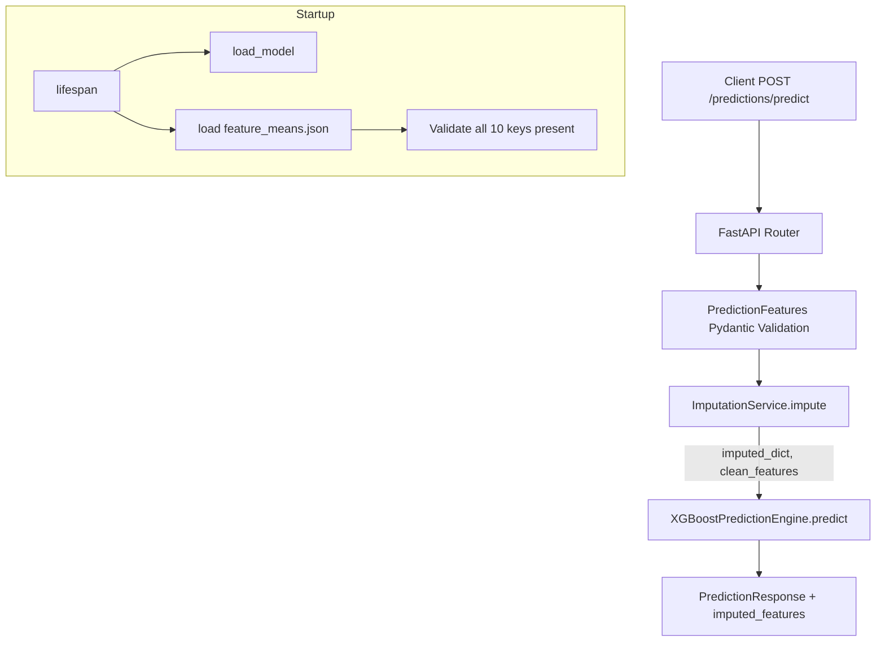
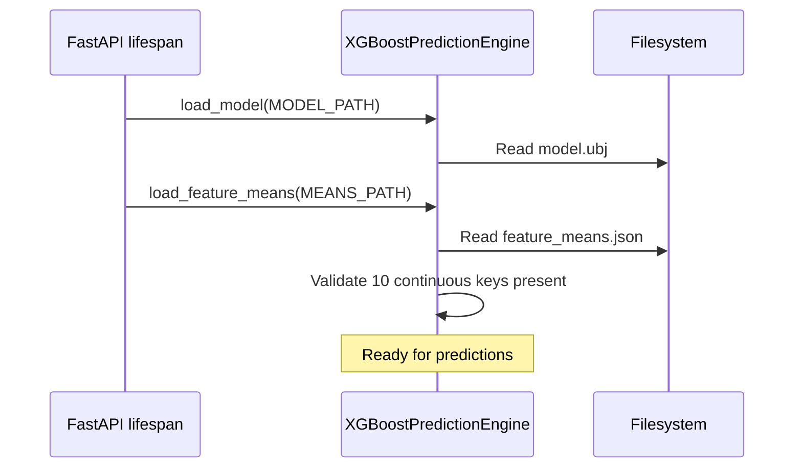

# Design Document: Missing Feature Imputation

## Overview

The cmv_ml prediction service runs an XGBoost model trained on a clean dataset (no missing values). When the frontend omits continuous features (`None`), the current engine substitutes `np.nan`, producing unreliable predictions because XGBoost's default missing-value path was never calibrated during training.

This design introduces a **mean imputation layer** between the Pydantic validation and the XGBoost inference call. A JSON config file (`feature_means.json`) stores training-set means for the 10 continuous features. At startup the engine loads these means alongside the model. At prediction time, an `ImputationService` replaces every `None` continuous feature with its training mean, records which features were imputed, and passes a complete (NaN-free) vector to XGBoost. The `PredictionResponse` is extended with an `imputed_features` dict so the frontend can warn clinicians.

### Design Decisions

| Decision | Rationale |
|---|---|
| Mean imputation (not median/model-based) | Simplest strategy that keeps the feature distribution close to training data; easy to explain to clinicians. |
| Separate JSON file for means | Decouples imputation config from code; can be regenerated per model version without code changes. |
| Imputation as a standalone service class | Single Responsibility: keeps the prediction engine focused on inference; imputation logic is independently testable. |
| Imputed-features dict in response (not a list) | Returning `{feature: mean_used}` gives the frontend both the "what" and the "with what" in one field. |

## Architecture



The imputation step is inserted **after** Pydantic validation and **before** the prediction engine call. This keeps both the schema layer and the engine layer unchanged in their core responsibilities.

### Startup Sequence



## Components and Interfaces

### 1. ImputationService

A pure-function style class (no mutable state after init) that performs mean imputation.

```python
class ImputationService:
    """Replaces None continuous features with training-set means."""

    CONTINUOUS_FEATURES: list[str]  # The 10 feature names

    def __init__(self, feature_means: dict[str, float]) -> None:
        """
        Args:
            feature_means: Mapping of continuous feature name -> training mean.
        Raises:
            ValueError: If any of the 10 continuous features is missing from the dict.
        """

    def impute(self, features: dict) -> tuple[dict, dict[str, float]]:
        """
        Replace None values with training means.

        Args:
            features: Raw feature dict from PredictionFeatures.model_dump().
        Returns:
            (clean_features, imputed_features)
            - clean_features: Copy of features with Nones replaced.
            - imputed_features: {feature_name: mean_value_used} for imputed fields only.
        """
```

### 2. XGBoostPredictionEngine (modified)

Minimal changes to the existing engine:

- **`load_feature_means(path: str) -> None`**: New method. Reads `feature_means.json`, validates all 10 keys, stores the dict. Creates an `ImputationService` instance.
- **`imputation_service`** property: Exposes the `ImputationService` for use by the router.
- **`feature_means`** property: Exposes the loaded means dict (read-only).

The `predict()` method itself is **not** changed — it still receives a feature dict and converts it to a numpy array. The imputation happens upstream in the router.

### 3. Router Changes (predictions.py)

The `predict` endpoint is updated to:

1. Call `prediction_engine.imputation_service.impute(features_dict)` before prediction.
2. Pass the clean features dict to `prediction_engine.predict()`.
3. Include `imputed_features` in the `PredictionResponse`.

### 4. PredictionResponse Schema (modified)

Add one field:

```python
imputed_features: dict[str, float] = Field(
    default_factory=dict,
    description="Map of imputed feature names to the training-mean value used."
)
```

### 5. Startup (main.py)

After `prediction_engine.load_model(MODEL_PATH)`, add:

```python
means_path = os.path.join(os.path.dirname(MODEL_PATH), "feature_means.json")
prediction_engine.load_feature_means(means_path)
```

If loading fails, the app raises `RuntimeError` and refuses to start — same pattern as the model file.

## Data Models

### feature_means.json

Located at `cmv_ml/models/feature_means.json` (same directory as `model.ubj`).

```json
{
  "hematocrit": 32.83,
  "neutrophils": 7.42,
  "sodium": 137.03,
  "glucose": 145.12,
  "bloodureanitro": 22.56,
  "creatinine": 1.68,
  "bmi": 30.55,
  "pulse": 79.04,
  "respiration": 19.21,
  "secondarydiagnosisnonicd9": 3.14
}
```

*(Values above are illustrative; actual values come from the training dataset.)*

**Schema constraints:**
- Exactly 10 keys matching `ImputationService.CONTINUOUS_FEATURES`.
- All values are finite positive floats.

### PredictionResponse (updated)

| Field | Type | Description |
|---|---|---|
| `prediction_id` | `UUID` | Unique ID for this prediction |
| `predicted_length_of_stay` | `float` | Predicted hospital stay in days |
| `shap_values` | `dict[str, float] \| None` | SHAP contributions (optional) |
| `imputed_features` | `dict[str, float]` | Map of imputed feature name → mean used. Empty dict if nothing imputed. |

### ImputationResult (internal)

Not a Pydantic model — just the tuple returned by `ImputationService.impute()`:

```python
tuple[dict, dict[str, float]]
#     ^clean_features  ^imputed_features
```


## Correctness Properties

*A property is a characteristic or behavior that should hold true across all valid executions of a system — essentially, a formal statement about what the system should do. Properties serve as the bridge between human-readable specifications and machine-verifiable correctness guarantees.*

### Property 1: Imputation correctness

*For any* valid feature dictionary with any combination of `None` and non-`None` continuous features:
- Every originally-`None` continuous feature in the output equals its training mean.
- Every originally-non-`None` feature in the output equals its original value.
- The `imputed_features` dict contains exactly the keys that were `None` in the input, each mapped to the correct training mean.

**Validates: Requirements 2.1, 2.2, 2.4, 3.1, 3.3, 5.2**

### Property 2: No-NaN invariant

*For any* valid feature dictionary (with any combination of `None` continuous features), after imputation and conversion to a numpy array, the resulting array contains zero `NaN` values.

**Validates: Requirements 2.5**

### Property 3: Missing config keys produce validation error

*For any* strict subset of the 10 continuous feature names used as keys in a means config dict, constructing an `ImputationService` with that dict should raise a `ValueError` whose message contains every missing feature name.

**Validates: Requirements 1.5**

### Property 4: Schema accepts None and valid numerics for continuous features

*For any* continuous feature and *for any* valid positive numeric value, the `PredictionFeatures` schema should accept both `None` and that numeric value without validation errors.

**Validates: Requirements 4.1, 4.2**

## Error Handling

| Scenario | Component | Behavior |
|---|---|---|
| `feature_means.json` not found | `XGBoostPredictionEngine.load_feature_means` | Raises `FileNotFoundError`. Lifespan catches it and raises `RuntimeError` → app refuses to start. |
| `feature_means.json` is invalid JSON | `XGBoostPredictionEngine.load_feature_means` | Raises `json.JSONDecodeError`. Lifespan wraps in `RuntimeError`. |
| Config missing one or more of the 10 keys | `ImputationService.__init__` | Raises `ValueError` listing the missing feature names. Propagates through lifespan as `RuntimeError`. |
| Config value is not a finite float | `ImputationService.__init__` | Raises `ValueError` identifying the invalid key/value. |
| `None` continuous feature at prediction time | `ImputationService.impute` | Normal path — replaced with mean. No error. |
| All features provided (no `None`) | `ImputationService.impute` | Returns original features unchanged, empty `imputed_features` dict. |
| Model not loaded when predict called | `XGBoostPredictionEngine.predict` | Existing `ModelNotLoadedError` → HTTP 503 (unchanged). |

The error strategy follows the existing pattern: fail fast at startup for configuration issues, return HTTP errors for runtime issues.

## Testing Strategy

### Property-Based Tests (Hypothesis)

The project already uses [Hypothesis](https://hypothesis.readthedocs.io/) (`.hypothesis/` directory exists at repo root). All property tests will use Hypothesis with a minimum of 100 examples per test.

Each property test must be tagged with a comment referencing the design property:

```python
# Feature: missing-feature-imputation, Property 1: Imputation correctness
```

**Test file:** `cmv_ml/app/tests/test_imputation_properties.py`

| Test | Property | Generator Strategy |
|---|---|---|
| `test_imputation_correctness` | Property 1 | Generate a dict of 10 continuous features where each is independently `None` or a positive float (`st.one_of(st.none(), st.floats(min_value=0.1, max_value=500))`). |
| `test_no_nan_invariant` | Property 2 | Same generator as above. After imputation, convert to numpy array via `_features_to_array` and assert `np.isnan(arr).sum() == 0`. |
| `test_missing_config_keys_error` | Property 3 | Generate a random strict subset of the 10 feature names (`st.lists(st.sampled_from(CONTINUOUS), min_size=0, max_size=9).map(set)`). Build a means dict with only those keys. Assert `ValueError` and check missing keys in message. |
| `test_schema_accepts_none_and_numerics` | Property 4 | Generate a continuous feature name and a positive float. Construct `PredictionFeatures` with that feature set to the float, then to `None`. Both should succeed. |

### Unit Tests (pytest)

**Test file:** `cmv_ml/app/tests/test_imputation_unit.py`

| Test | What it covers |
|---|---|
| `test_load_feature_means_success` | Load a valid `feature_means.json` and verify the engine exposes the means dict (Req 1.1, 1.2, 1.3). |
| `test_load_feature_means_file_not_found` | Attempt to load from a non-existent path → `FileNotFoundError` (Req 1.4 edge case). |
| `test_load_feature_means_invalid_json` | Load a file with broken JSON → error (Req 1.4 edge case). |
| `test_impute_all_none` | All 10 continuous features are `None` → all replaced with means, all 10 listed as imputed (Req 5.3 edge case). |
| `test_impute_none_missing` | All features provided → empty imputed dict, values unchanged (Req 5.2 edge case). |
| `test_response_schema_has_imputed_features` | Verify `PredictionResponse` accepts `imputed_features` dict and defaults to `{}` (Req 3.2 edge case). |
| `test_binary_features_default_to_zero` | Construct `PredictionFeatures()` with no binary args → all binary fields are 0 (Req 4.3 example). |

### Test Configuration

- Property tests: `@settings(max_examples=100)` minimum
- All tests runnable via `pytest cmv_ml/app/tests/ --run`
- No mocking of the imputation logic itself — it's pure functions, test directly
- XGBoost model loading can be mocked in integration tests where needed
