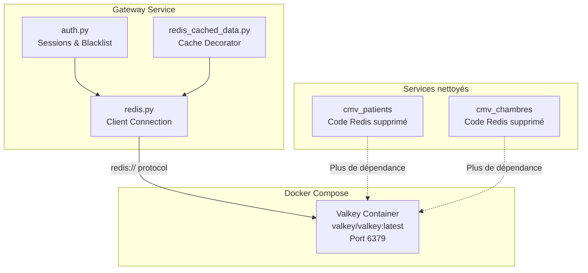

# Document de Design : Migration Redis vers Valkey

## Vue d'ensemble

Cette migration remplace l'image Docker Redis par Valkey dans tous les fichiers Docker Compose, met à jour les variables d'environnement, nettoie le code mort Redis dans les services Patients et Chambres, et adapte les fixtures de test. L'approche est conservatrice : Valkey étant compatible protocole Redis, le package Python `redis` (redis-py) est conservé tel quel. Les changements se concentrent sur l'infrastructure Docker et la configuration.

## Architecture

La migration n'altère pas l'architecture existante. Le service Valkey remplace Redis en tant que store clé-valeur in-memory, utilisé uniquement par le Gateway pour :
- La gestion des sessions (`session:{session_id}` → expiration 1h)
- Le blacklisting de tokens JWT (`blacklist:{token}` → expiration 1h)
- Un décorateur de cache (`redis_cached_data.py`) potentiellement inutilisé



### Décision de design : Conserver redis-py

Valkey propose un package Python dédié (`valkey-py`), mais nous conservons `redis-py` pour les raisons suivantes :
1. Valkey supporte nativement le protocole `redis://` — aucun changement de client nécessaire
2. Minimise les modifications de code et le risque de régression
3. `fakeredis` (utilisé dans les tests du Gateway) reste compatible
4. Approche la plus sûre pour une présentation devant jury

## Composants et Interfaces

### 1. Fichiers Docker Compose (4 fichiers)

Fichiers concernés :
- `docker-compose.yml`
- `dev-docker-compose.yml`
- `preprod-docker-compose.yml`
- `redis-compose.yml` → renommé en `valkey-compose.yml`

Modification unique : `image: redis:latest` → `image: valkey/valkey:latest`

Le nom de service Docker reste `redis` dans les fichiers multi-services pour éviter de casser les références réseau internes. Seul le fichier dédié est renommé.

### 2. Variables d'environnement

Fichier `.env` :
```
# Avant
REDIS_HOST="redis"
REDIS_PORT="6379"

# Après
VALKEY_HOST="redis"
VALKEY_PORT="6379"
```

Note : La valeur de `VALKEY_HOST` reste `"redis"` car c'est le nom du service Docker dans le réseau interne. Renommer le service Docker casserait les `depends_on` et `links`.

### 3. Client Redis du Gateway

Fichier `cmv_gateway/cmv_back/app/dependancies/redis.py` :

```python
# Avant (URLs codées en dur)
if ENVIRONMENT != "preprod":
    redis_client = aioredis.from_url("redis://localhost:6379", decode_responses=True)
else:
    redis_client = aioredis.from_url("redis://redis:6379", decode_responses=True)

# Après (utilisation des variables d'environnement)
redis_client = aioredis.from_url(
    f"redis://{VALKEY_HOST}:{VALKEY_PORT}",
    decode_responses=True
)
```

Le fichier `config.py` du Gateway devra exporter `VALKEY_HOST` et `VALKEY_PORT`.

### 4. Nettoyage du code mort

**Service Patients** :
- Supprimer `cmv_patients/app/dependancies/redis.py`
- Supprimer l'import `from .redis import redis_client` et l'alias `redis = redis_client` dans `cmv_patients/app/dependancies/auth.py`
- Supprimer la fixture `redis_client` et l'import `from redis.asyncio import Redis` dans `cmv_patients/app/tests/conftest.py`
- Retirer `fakeredis` de `cmv_patients/requirements.txt`

**Service Chambres** :
- Supprimer `cmv_chambres/app/dependancies/redis.py`
- Retirer `fakeredis` de `cmv_chambres/requirements.txt`

### 5. Renommage du fichier Compose dédié

`redis-compose.yml` → `valkey-compose.yml` avec l'image mise à jour.

## Modèles de Données

Aucun changement de modèle de données. Les structures clé-valeur dans Valkey restent identiques :

| Clé | Valeur | TTL | Usage |
|-----|--------|-----|-------|
| `session:{uuid}` | `user_id` (string) | 3600s | Gestion de session |
| `blacklist:{jwt_token}` | `"true"` (string) | 3600s | Invalidation de token |
| `{cache_key}` | JSON sérialisé | configurable | Cache de données (décorateur) |


## Propriétés de Correction

*Une propriété est une caractéristique ou un comportement qui doit rester vrai pour toutes les exécutions valides d'un système — essentiellement, une déclaration formelle sur ce que le système doit faire. Les propriétés servent de pont entre les spécifications lisibles par l'humain et les garanties de correction vérifiables par la machine.*

La majorité des exigences de cette migration sont des changements de configuration (fichiers Docker Compose, variables d'environnement, suppression de fichiers). Ces changements sont vérifiables par des tests unitaires spécifiques (exemples), pas par des propriétés universelles.

La seule propriété universelle concerne le maintien fonctionnel du stockage clé-valeur après migration :

### Property 1 : Round-trip des opérations clé-valeur

*Pour toute* clé et valeur valides (sessions `session:{id}` ou tokens blacklistés `blacklist:{token}`), stocker la valeur avec `setex` puis la récupérer avec `get` doit retourner la valeur originale, tant que le TTL n'est pas expiré.

**Validates: Requirements 3.3, 3.4**

## Gestion des Erreurs

| Scénario | Comportement attendu | Exigence |
|----------|---------------------|----------|
| Valkey indisponible au démarrage | Le Gateway échoue au démarrage avec une erreur de connexion claire | 3.1 |
| Valkey indisponible en cours d'exécution | Les opérations Redis lèvent `ConnectionError`, le Gateway retourne HTTP 500 | 3.3, 3.4 |
| Variable `VALKEY_HOST` manquante | Le module `config.py` utilise une valeur par défaut (`localhost`) | 2.2 |
| Variable `VALKEY_PORT` manquante | Le module `config.py` utilise une valeur par défaut (`6379`) | 2.2 |

Aucun nouveau mécanisme de gestion d'erreur n'est nécessaire. Le comportement existant est préservé car le protocole est identique.

## Stratégie de Test

### Tests unitaires (exemples et cas limites)

Les tests unitaires existants du Gateway utilisent un mock Redis (`AsyncMock` dans `conftest.py`). Ce mock est indépendant du serveur et continuera de fonctionner sans modification. Les tests vérifient :
- La création de session (`create_session`)
- La vérification de blacklist (`get_current_user`)
- La déconnexion avec nettoyage de session (`signout`)
- Le rafraîchissement de token (`refresh`)

Après la migration, les tests existants doivent passer sans modification car ils mockent le client Redis.

### Tests property-based

Bibliothèque : `hypothesis` (Python)

Configuration : minimum 100 itérations par test.

Chaque propriété de correction doit être implémentée par un seul test property-based :

- **Feature: redis-to-valkey-migration, Property 1: Round-trip des opérations clé-valeur**
  - Générer des paires clé-valeur aléatoires
  - Stocker avec `setex`, récupérer avec `get`
  - Vérifier l'égalité
  - Ce test nécessite une instance Valkey (ou `fakeredis`) pour s'exécuter

### Vérifications statiques post-migration

En complément des tests automatisés, des vérifications manuelles simples :
1. `docker compose up` démarre le conteneur Valkey sans erreur
2. Login/logout fonctionnent via l'API Gateway
3. Le rafraîchissement de token fonctionne
4. Les tests existants (`pytest`) passent dans les 3 services
