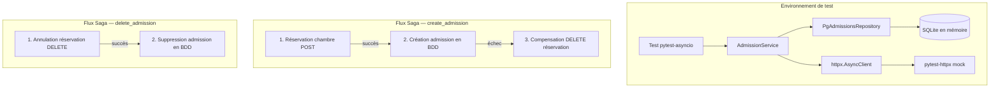

# Design technique — Tests du pattern Saga

## Vue d'ensemble

Ce document décrit l'architecture technique des tests pour le pattern Saga implémenté dans `AdmissionService`. L'objectif est de valider le comportement de la saga (création/suppression d'admissions) en testant les chemins nominaux, les cas d'erreur et les mécanismes de compensation.

Les tests ciblent directement la couche service (`AdmissionService`) en :
- Utilisant une base SQLite en mémoire via les fixtures existantes (`conftest.py`)
- Mockant les appels HTTP vers le Service_Chambres via `pytest-httpx`
- Injectant un `PgAdmissionsRepository` réel connecté à la base de test

Cette approche teste la logique d'orchestration de la saga sans dépendance externe, tout en validant les interactions réelles avec la base de données.

## Architecture



### Décisions de conception

1. **Tests au niveau service, pas au niveau routeur** : On teste `AdmissionService` directement pour isoler la logique Saga des préoccupations HTTP/auth du routeur. Cela permet un contrôle fin sur les mocks et les assertions.

2. **pytest-httpx pour le mocking HTTP** : Le projet utilise déjà `pytest-httpx==0.36.0` dans les dépendances de dev. Cette bibliothèque s'intègre nativement avec `httpx.AsyncClient` et permet de configurer des réponses mockées de manière déclarative.

3. **Base de données réelle (SQLite)** : Plutôt que de mocker le repository, on utilise la base SQLite en mémoire existante. Cela valide les interactions réelles avec SQLAlchemy (commit, rollback, refresh) qui sont critiques pour le pattern Saga.

4. **Hypothesis pour les tests property-based** : La bibliothèque Hypothesis est déjà présente dans le projet (dossier `.hypothesis/` existant). Elle sera utilisée pour les propriétés de correction identifiées.

## Composants et interfaces

### AdmissionService (système sous test)

```python
class AdmissionService:
    admissions_repository: PgAdmissionsRepository

    async def create_admission(self, db, data: CreateAdmission, internal_payload, request) -> Admission
    async def delete_admission(self, db, admission_id: int, internal_payload, request) -> dict
    async def _reserve_room(self, client, data, headers) -> dict
    async def _compensate_reservation(self, client, reservation, headers) -> None
```

### Dépendances à configurer dans les tests

| Dépendance | Stratégie | Détail |
|---|---|---|
| `db: Session` | Fixture `db_session` | SQLite en mémoire, reset par test |
| `httpx.AsyncClient` | `pytest-httpx` | Mock des appels POST/DELETE vers Service_Chambres |
| `PgAdmissionsRepository` | Instance réelle | Connectée à la session SQLite |
| `internal_payload` | Chaîne factice | `"fake-token"` |
| `request` | Mock `MagicMock` | Avec headers `X-Real-IP` et `X-Forwarded-For` |

### Fixtures spécifiques aux tests Saga

```python
@pytest.fixture
def admission_service():
    """Service avec repository réel."""
    return AdmissionService(admissions_repository=PgAdmissionsRepository())

@pytest.fixture
def mock_request():
    """Request factice avec headers IP."""
    request = MagicMock()
    request.headers = {"X-Real-IP": "127.0.0.1", "X-Forwarded-For": "127.0.0.1"}
    return request

@pytest.fixture
def patient_in_db(db_session):
    """Patient pré-inséré pour les tests d'admission."""
    patient = Patient(
        civilite="AUTRE", nom="test", prenom="patient",
        adresse="1 rue test", code_postal="64000", ville="Pau",
        telephone="0600000000",
        date_de_naissance=datetime(1990, 1, 1),
    )
    db_session.add(patient)
    db_session.commit()
    return patient
```

### URLs mockées

Les appels HTTP vers le Service_Chambres suivent ces patterns :
- **Réservation** : `POST {CHAMBRES_SERVICE}/chambres/{service_id}/reserver`
- **Annulation** : `DELETE {CHAMBRES_SERVICE}/chambres/{reservation_id}/{chambre_id}/cancel`

## Modèles de données

### CreateAdmission (entrée)

```python
class CreateAdmission(BaseModel):
    patient_id: int
    ambulatoire: bool
    entree_le: datetime
    sortie_prevue_le: datetime
    service_id: int | None = None  # Requis si ambulatoire=False
```

### Admission (modèle SQLAlchemy)

| Champ | Type | Description |
|---|---|---|
| `id_admission` | `int` (PK) | Auto-incrémenté |
| `patient_id` | `int` (FK) | Référence vers Patient |
| `ambulatoire` | `bool` | Type d'admission |
| `entree_le` | `datetime` | Date d'entrée |
| `sortie_prevue_le` | `datetime` | Date de sortie prévue |
| `ref_reservation` | `int \| None` | ID réservation (Service_Chambres) |

### Réponse du Service_Chambres (mockée)

```python
# POST réservation — 201
{"reservation_id": 42, "chambre_id": 7}

# DELETE annulation — 200
{"message": "reservation_cancelled"}
```


## Propriétés de correction

*Une propriété est une caractéristique ou un comportement qui doit rester vrai pour toutes les exécutions valides d'un système — essentiellement, une déclaration formelle de ce que le système doit faire. Les propriétés servent de pont entre les spécifications lisibles par l'humain et les garanties de correction vérifiables par la machine.*

### Propriété 1 : Round-trip admission ambulatoire

*Pour toute* `CreateAdmission` avec `ambulatoire=True`, `patient_id` valide, `entree_le` et `sortie_prevue_le` quelconques, l'admission retournée par `create_admission` doit avoir `ref_reservation == None`, `ambulatoire == True`, et les champs `patient_id`, `entree_le`, `sortie_prevue_le` identiques aux données soumises. De plus, aucun appel HTTP ne doit être émis.

**Valide : Exigences 1.1, 1.2, 1.3**

### Propriété 2 : Round-trip admission non ambulatoire avec réservation

*Pour tout* `reservation_id` et `chambre_id` retournés par le Service_Chambres (statut 201), et pour toute `CreateAdmission` avec `ambulatoire=False` et un `service_id` valide, l'admission retournée par `create_admission` doit avoir `ref_reservation == reservation_id` et les champs `patient_id`, `entree_le`, `sortie_prevue_le`, `ambulatoire` correspondant aux données soumises.

**Valide : Exigences 2.1, 2.2, 2.3**

### Propriété 3 : Échec de réservation empêche la création en base

*Pour tout* code de statut HTTP retourné par le Service_Chambres différent de 201 (incluant 404, 500, et tout autre code d'erreur), `create_admission` doit lever une `HTTPException` et aucune admission ne doit être persistée en base de données.

**Valide : Exigences 3.1, 3.2, 3.3**

### Propriété 4 : Compensation après échec de création en base

*Pour toute* réservation réussie (statut 201 avec `reservation_id` et `chambre_id`) suivie d'une exception lors de la création en base, `AdmissionService` doit émettre un appel DELETE vers `{CHAMBRES_SERVICE}/chambres/{reservation_id}/{chambre_id}/cancel` et propager l'erreur originale au code appelant.

**Valide : Exigences 4.1, 4.2, 4.3**

### Propriété 5 : Résilience de la compensation

*Pour toute* exception levée lors de l'appel DELETE de compensation, l'erreur de compensation ne doit pas se propager. L'erreur propagée au code appelant doit être l'erreur originale (celle qui a déclenché la compensation), pas l'erreur de compensation.

**Valide : Exigences 5.1, 5.2**

### Propriété 6 : Suppression avec annulation de réservation

*Pour toute* admission non ambulatoire avec `ref_reservation` non nul, `delete_admission` doit émettre un appel DELETE vers le Service_Chambres, et si le statut retourné est 200 ou 404, l'admission doit être supprimée de la base de données et le résultat doit être `{"message": "admission_deleted"}`.

**Valide : Exigences 6.1, 6.2, 6.3**

### Propriété 7 : Suppression ambulatoire sans appel HTTP

*Pour toute* admission ambulatoire, `delete_admission` doit supprimer l'admission de la base de données sans émettre d'appel HTTP vers le Service_Chambres, et retourner `{"message": "admission_deleted"}`.

**Valide : Exigences 7.1, 7.2**

### Propriété 8 : Échec d'annulation préserve l'admission

*Pour tout* code de statut HTTP retourné par le Service_Chambres différent de 200 et 404 lors de l'annulation d'une réservation, `delete_admission` doit lever une `HTTPException` avec le statut 400 et le détail `failed_to_cancel_reservation`, et l'admission doit toujours être présente en base de données.

**Valide : Exigences 8.1, 8.2, 8.3**

## Gestion des erreurs

### Matrice des erreurs et comportements attendus

| Scénario | Erreur | Comportement attendu | Compensation |
|---|---|---|---|
| Réservation 404 | `HTTPException(404, "no_room_available")` | Pas de création en base | Aucune |
| Réservation != 201 | `HTTPException(500, "reservation_failed")` | Pas de création en base | Aucune |
| Création BDD échoue (Exception) | Exception quelconque | DELETE réservation | Oui |
| Création BDD échoue (HTTPException) | HTTPException quelconque | DELETE réservation, re-raise | Oui |
| Compensation échoue | Exception dans DELETE | Print de l'erreur, propagation erreur originale | Échouée |
| Annulation réservation != 200/404 | `HTTPException(400, "failed_to_cancel_reservation")` | Rollback BDD, admission préservée | N/A |
| Admission inexistante | `HTTPException(404, "admission_not_found")` | Pas de suppression | N/A |

### Stratégie de mock des erreurs

Pour simuler les échecs de création en base, on utilisera un repository mocké (via `pytest-mock`) qui lève une exception sur `create_admission`. Cela permet de tester la compensation sans corrompre la session SQLAlchemy.

Pour les erreurs HTTP, `pytest-httpx` permet de configurer des réponses avec n'importe quel code de statut ou de lever des exceptions réseau.

## Stratégie de tests

### Approche duale

Les tests combinent deux approches complémentaires :

1. **Tests unitaires (pytest)** : Vérifient des exemples spécifiques, les cas limites et les codes d'erreur exacts (404, 500, 400). Ils couvrent les critères non testables en tant que propriétés (edge cases, messages d'erreur précis).

2. **Tests property-based (Hypothesis)** : Vérifient les propriétés universelles identifiées ci-dessus. Chaque propriété est implémentée par un seul test Hypothesis avec un minimum de 100 itérations.

### Bibliothèque PBT

- **Hypothesis** (déjà présente dans le projet — dossier `.hypothesis/` existant)
- Configuration : `@settings(max_examples=100)` minimum par test
- Chaque test property-based doit être annoté avec un commentaire référençant la propriété du design :
  ```python
  # Feature: saga-pattern-tests, Property 1: Round-trip admission ambulatoire
  ```

### Organisation des tests

Fichier : `cmv_patients/app/tests/test_admissions_saga.py`

#### Tests unitaires (exemples et edge cases)

| Test | Exigence | Type |
|---|---|---|
| `test_reservation_404_raises_no_room_available` | 3.1 | Exemple |
| `test_reservation_500_raises_reservation_failed` | 3.2 | Exemple |
| `test_compensation_on_http_exception_reraises_same` | 4.3 | Exemple |
| `test_compensation_failure_logs_print` | 5.3 | Exemple |
| `test_delete_returns_admission_deleted_message` | 6.3 | Exemple |
| `test_delete_ambulatoire_returns_admission_deleted` | 7.2 | Exemple |
| `test_delete_nonexistent_admission_raises_404` | 9.1 | Edge case |

#### Tests property-based (Hypothesis)

| Test | Propriété | Exigences |
|---|---|---|
| `test_prop_ambulatoire_roundtrip` | Propriété 1 | 1.1, 1.2, 1.3 |
| `test_prop_non_ambulatoire_roundtrip` | Propriété 2 | 2.1, 2.2, 2.3 |
| `test_prop_reservation_failure_prevents_creation` | Propriété 3 | 3.1, 3.2, 3.3 |
| `test_prop_compensation_on_db_failure` | Propriété 4 | 4.1, 4.2, 4.3 |
| `test_prop_compensation_resilience` | Propriété 5 | 5.1, 5.2 |
| `test_prop_delete_with_reservation_cancellation` | Propriété 6 | 6.1, 6.2, 6.3 |
| `test_prop_delete_ambulatoire_no_http` | Propriété 7 | 7.1, 7.2 |
| `test_prop_cancel_failure_preserves_admission` | Propriété 8 | 8.1, 8.2, 8.3 |

### Générateurs Hypothesis

```python
# Stratégie pour CreateAdmission ambulatoire
ambulatoire_admission = st.builds(
    CreateAdmission,
    patient_id=st.just(1),  # Patient pré-inséré via fixture
    ambulatoire=st.just(True),
    entree_le=st.datetimes(min_value=datetime(2020, 1, 1), max_value=datetime(2030, 12, 31)),
    sortie_prevue_le=st.datetimes(min_value=datetime(2020, 1, 1), max_value=datetime(2030, 12, 31)),
    service_id=st.none(),
)

# Stratégie pour CreateAdmission non ambulatoire
non_ambulatoire_admission = st.builds(
    CreateAdmission,
    patient_id=st.just(1),
    ambulatoire=st.just(False),
    entree_le=st.datetimes(min_value=datetime(2020, 1, 1), max_value=datetime(2030, 12, 31)),
    sortie_prevue_le=st.datetimes(min_value=datetime(2020, 1, 1), max_value=datetime(2030, 12, 31)),
    service_id=st.integers(min_value=1, max_value=100),
)

# Stratégie pour les codes d'erreur HTTP (hors 201)
error_status_codes = st.integers(min_value=200, max_value=599).filter(lambda x: x != 201)

# Stratégie pour les codes d'échec d'annulation (hors 200 et 404)
cancel_failure_codes = st.integers(min_value=200, max_value=599).filter(lambda x: x not in (200, 404))

# Stratégie pour les IDs de réservation
reservation_ids = st.integers(min_value=1, max_value=10000)
chambre_ids = st.integers(min_value=1, max_value=500)
```

### Contraintes techniques

- Les tests Hypothesis avec accès BDD nécessitent une gestion spéciale de la session SQLAlchemy (reset entre chaque exemple généré)
- `pytest-httpx` doit être configuré pour chaque test via la fixture `httpx_mock`
- Les tests async utilisent `@pytest.mark.asyncio` avec `pytest-asyncio`
