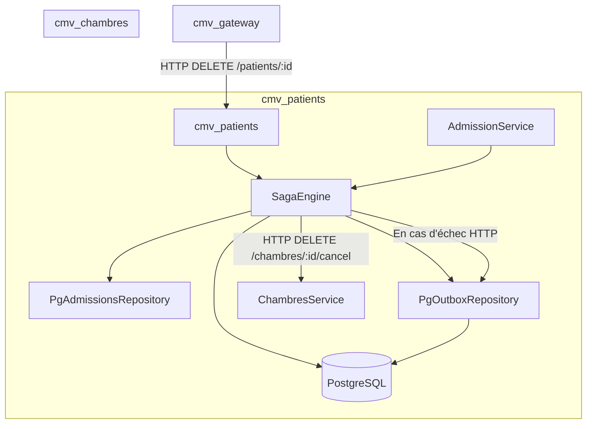
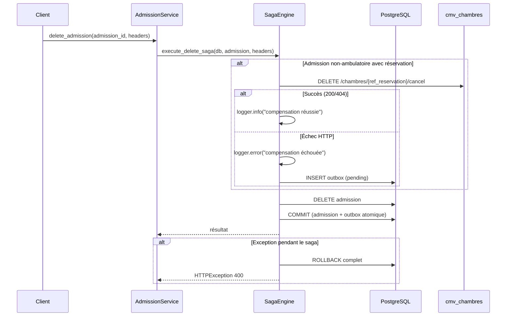

# Design — Saga Resilience Improvement

## Overview

Cette feature améliore la résilience du pattern saga distribué dans `cmv_patients` pour le flux de suppression patient/admission. Le saga actuel souffre de plusieurs faiblesses : logging via `print()`, deux implémentations divergentes de `delete_admission` (dans `PatientsService` et `AdmissionService`), absence de persistance des compensations échouées, gestion transactionnelle incohérente, et absence de headers d'authentification dans les appels de compensation.

Le design introduit un **Saga Engine** centralisé dans `cmv_patients` qui orchestre les étapes du saga, une **table outbox** pour persister les compensations échouées, et un mécanisme de retry configurable. L'objectif est de garantir la cohérence des données entre `cmv_patients` et `cmv_chambres` même en cas de défaillance réseau.

### Décisions de design clés

1. **Saga Engine comme module interne** : Pas de framework externe — un module Python dans `cmv_patients/app/services/saga_engine.py` suffit pour la complexité actuelle.
2. **Outbox pattern** : Table SQLAlchemy dans la même base que les admissions, commitée dans la même transaction que la suppression.
3. **Retry via endpoint dédié ou tâche planifiée** : Un endpoint `/admin/outbox/retry` permet de déclencher manuellement le retry, avec possibilité d'ajouter un cron plus tard.
4. **Unification dans AdmissionService** : `PatientsService.delete_admission` délègue à `AdmissionService.delete_admission` au lieu de dupliquer la logique.

## Architecture



### Flux de suppression d'admission (refactorisé)



## Components and Interfaces

### 1. SagaEngine (`cmv_patients/app/services/saga_engine.py`)

Module central orchestrant le saga de suppression. Responsable du logging structuré, de la gestion transactionnelle et de l'insertion outbox.

```python
class SagaEngine:
    def __init__(
        self,
        admissions_repository: PgAdmissionsRepository,
        outbox_repository: PgOutboxRepository,
        logger: logging.Logger,
        http_client: httpx.AsyncClient,
    ): ...

    async def execute_delete_admission(
        self,
        db: Session,
        admission: Admission,
        headers: dict,
    ) -> dict:
        """Orchestre la suppression d'une admission avec compensation."""
        ...

    async def _cancel_reservation(
        self,
        db: Session,
        admission: Admission,
        headers: dict,
    ) -> bool:
        """Tente d'annuler la réservation. Insère dans outbox si échec."""
        ...

    async def retry_pending_compensations(
        self,
        db: Session,
        max_retries: int = 5,
    ) -> dict:
        """Rejoue les compensations pending de la table outbox."""
        ...
```

### 2. PgOutboxRepository (`cmv_patients/app/repositories/outbox_crud.py`)

Repository CRUD pour la table outbox.

```python
class PgOutboxRepository:
    async def create_entry(self, db: Session, entry: OutboxEntry) -> OutboxEntry: ...
    async def get_pending_entries(self, db: Session, max_retries: int) -> list[OutboxEntry]: ...
    async def update_status(self, db: Session, entry_id: int, status: str, increment_retries: bool = False) -> None: ...
```

### 3. AdmissionService (refactorisé)

`delete_admission` est unifié : une seule implémentation qui délègue au `SagaEngine`.

```python
class AdmissionService:
    async def delete_admission(
        self, db: Session, admission_id: int, internal_payload: str, request
    ) -> dict:
        # Récupère l'admission, construit les headers, délègue au SagaEngine
        ...
```

### 4. PatientsService (refactorisé)

`delete_patient` appelle `AdmissionService.delete_admission` au lieu de sa propre implémentation.

```python
class PatientsService:
    async def delete_patient(self, db: Session, patient_id: int, headers: dict):
        # Pour chaque admission : appelle admission_service.delete_admission
        ...
```

## Data Models

### OutboxEntry (`cmv_patients/app/sql/models.py`)

```python
class OutboxStatus(enum.Enum):
    PENDING = "pending"
    COMPLETED = "completed"
    FAILED = "failed"

class OutboxEntry(Base):
    __tablename__ = "outbox"

    id: Mapped[int] = mapped_column(primary_key=True, index=True)
    compensation_type: Mapped[str] = mapped_column(String, nullable=False)
    payload: Mapped[dict] = mapped_column(JSON, nullable=False)
    retry_count: Mapped[int] = mapped_column(Integer, default=0)
    status: Mapped[OutboxStatus] = mapped_column(
        Enum(OutboxStatus), default=OutboxStatus.PENDING
    )
    created_at: Mapped[datetime] = mapped_column(DateTime, server_default=func.now())
    last_attempted_at: Mapped[datetime] = mapped_column(DateTime, nullable=True)
```

### Migration Alembic

Une migration Alembic crée la table `outbox` dans la base `cmv_patients`.

### Payload JSON type pour cancel_reservation

```json
{
  "reservation_id": 42,
  "admission_id": 10,
  "chambres_service_url": "http://cmv_chambres:8000",
  "endpoint": "/chambres/42/cancel"
}
```


## Correctness Properties

*Une propriété est une caractéristique ou un comportement qui doit rester vrai pour toutes les exécutions valides d'un système — essentiellement, une déclaration formelle de ce que le système doit faire. Les propriétés servent de pont entre les spécifications lisibles par l'humain et les garanties de correction vérifiables par la machine.*

### Property 1 : Logging structuré des compensations

*Pour toute* exécution de compensation HTTP par le SagaEngine, si la compensation réussit, le logger doit être appelé avec le niveau INFO incluant l'identifiant de l'admission et le type de compensation ; si la compensation échoue, le logger doit être appelé avec le niveau ERROR incluant l'identifiant de l'admission, l'identifiant de la réservation, le type de compensation et le message d'erreur.

**Validates: Requirements 1.1, 1.2**

### Property 2 : Annulation de réservation avant suppression

*Pour toute* admission non-ambulatoire avec une `ref_reservation` non nulle, l'exécution du saga de suppression doit émettre un appel HTTP DELETE vers le Service_Chambres pour annuler la réservation, et cet appel doit précéder la suppression de l'admission en base de données.

**Validates: Requirements 2.3**

### Property 3 : Rollback sur échec d'annulation

*Pour tout* code de statut HTTP différent de 200 et 404 retourné par le Service_Chambres lors de l'annulation d'une réservation, le SagaEngine doit effectuer un rollback de la session de base de données et l'admission doit rester présente en base.

**Validates: Requirements 2.4**

### Property 4 : Insertion outbox sur échec de compensation

*Pour toute* compensation HTTP échouée (erreur réseau ou code HTTP d'erreur), le SagaEngine doit insérer un enregistrement dans la table outbox avec le statut "pending", le payload contenant les informations nécessaires pour rejouer la compensation (reservation_id, admission_id, endpoint), et un retry_count à 0.

**Validates: Requirements 3.2, 3.6**

### Property 5 : Cycle de vie du retry outbox

*Pour tout* ensemble d'enregistrements outbox avec statut "pending" et un retry_count inférieur au seuil configurable, le processus de retry doit tenter de rejouer chaque compensation et mettre à jour le statut à "completed" si la compensation réussit, ou incrémenter le retry_count et conserver le statut "pending" si elle échoue.

**Validates: Requirements 3.3, 3.4, 3.6**

### Property 6 : Seuil de retry atteint

*Pour tout* enregistrement outbox dont le retry_count atteint le seuil configurable après un échec de retry, le SagaEngine doit mettre à jour le statut à "failed" et enregistrer l'échec via le logger avec le niveau CRITICAL.

**Validates: Requirements 3.5**

### Property 7 : Transaction atomique du saga

*Pour toute* exécution du saga de suppression d'admission, le `db.commit()` doit être appelé exactement une fois, après que la suppression de l'admission et l'éventuelle insertion outbox soient toutes deux terminées.

**Validates: Requirements 4.1, 4.3**

### Property 8 : Rollback complet sur exception

*Pour toute* exception survenant pendant une étape locale du saga (suppression admission ou insertion outbox), le SagaEngine doit effectuer un `db.rollback()` complet et aucune modification ne doit persister en base de données.

**Validates: Requirements 4.2**

### Property 9 : Transmission des headers d'authentification

*Pour toute* compensation HTTP exécutée par le SagaEngine, la requête doit inclure les headers Authorization, X-Real-IP et X-Forwarded-For avec les valeurs transmises par l'appelant.

**Validates: Requirements 5.1**

### Property 10 : Token de service pour les retries outbox

*Pour toute* compensation rejouée depuis la table outbox, le SagaEngine doit utiliser un token de service interne pour le header Authorization, indépendamment du token utilisateur original stocké dans le payload.

**Validates: Requirements 5.2**

## Error Handling

### Erreurs de compensation HTTP

| Scénario | Comportement |
|---|---|
| Service_Chambres retourne 200 ou 404 | Compensation considérée réussie, logger.info |
| Service_Chambres retourne autre code | Compensation échouée, logger.error, insertion outbox |
| Erreur réseau (ConnectError, Timeout) | Compensation échouée, logger.error, insertion outbox |
| Outbox retry réussit | Statut → "completed" |
| Outbox retry échoue, retry_count < seuil | retry_count++, statut reste "pending" |
| Outbox retry échoue, retry_count >= seuil | Statut → "failed", logger.critical |

### Erreurs transactionnelles

| Scénario | Comportement |
|---|---|
| Exception pendant suppression admission | db.rollback(), HTTPException 400 |
| Exception pendant insertion outbox | db.rollback(), HTTPException 400 |
| Exception pendant commit | db.rollback(), HTTPException 500 |

### Erreurs d'authentification

| Scénario | Comportement |
|---|---|
| Headers manquants dans la requête originale | Utiliser des valeurs par défaut ("unknown" pour IP) |
| Token expiré lors du retry outbox | Utiliser le token de service interne |

## Testing Strategy

### Approche duale

- **Tests unitaires** : Cas spécifiques, edge cases, vérifications d'intégration entre composants
- **Tests property-based** : Propriétés universelles validées sur 100+ itérations avec Hypothesis

### Bibliothèque PBT

**Hypothesis** (déjà utilisée dans le projet, cf. `test_admissions_saga.py`).

Chaque test property-based doit :
- Exécuter minimum 100 itérations (`@settings(max_examples=100)`)
- Référencer la propriété du design document via un commentaire tag
- Format du tag : `# Feature: saga-resilience-improvement, Property {N}: {titre}`

### Tests unitaires

- Vérification que `PatientsService.delete_patient` délègue à `AdmissionService.delete_admission` (Req 2.1, 2.2)
- Vérification que la table outbox a les bonnes colonnes (Req 3.1)
- Vérification qu'aucun `print()` n'existe dans le SagaEngine (Req 1.3)
- Edge case : admission ambulatoire sans réservation → pas d'appel HTTP, pas d'outbox
- Edge case : admission inexistante → HTTPException 404

### Tests property-based

| Property | Stratégie de génération | Ce qui varie |
|---|---|---|
| P1 : Logging structuré | admission_ids × reservation_ids × error_messages | IDs, messages d'erreur, succès/échec |
| P2 : Cancel avant delete | non_ambulatoire_admissions × reservation_ids | Données d'admission, IDs de réservation |
| P3 : Rollback sur échec cancel | error_status_codes (hors 200, 404) | Codes HTTP d'erreur |
| P4 : Insertion outbox | non_ambulatoire_admissions × error_types | Type d'erreur (réseau, HTTP) |
| P5 : Cycle retry | outbox_entries × retry_counts × success/failure | Nombre de tentatives, résultat du retry |
| P6 : Seuil retry | outbox_entries_at_max × thresholds | Seuils configurables |
| P7 : Transaction atomique | admissions × compensation_outcomes | Succès/échec compensation |
| P8 : Rollback complet | admissions × failure_points | Point d'échec dans le saga |
| P9 : Headers auth | tokens × ip_addresses | Valeurs des headers |
| P10 : Token service retry | outbox_entries × service_tokens | Tokens de service |

### Mocking

- `httpx.AsyncClient` : mocké via `pytest-httpx` (déjà en place)
- `db.commit()` / `db.rollback()` : espionnés via `mocker.spy` pour vérifier l'ordre d'appel
- `logging.Logger` : mocké pour vérifier les appels avec les bons niveaux et messages
- Base de données : SQLite in-memory (déjà configuré dans `conftest.py`)
