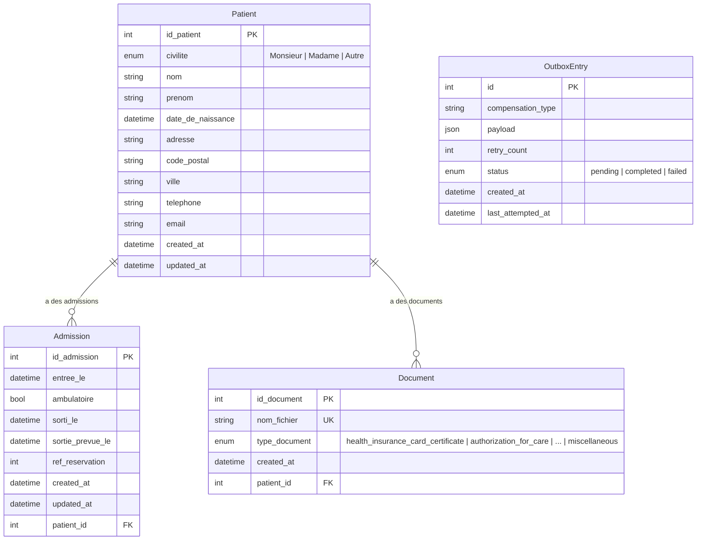
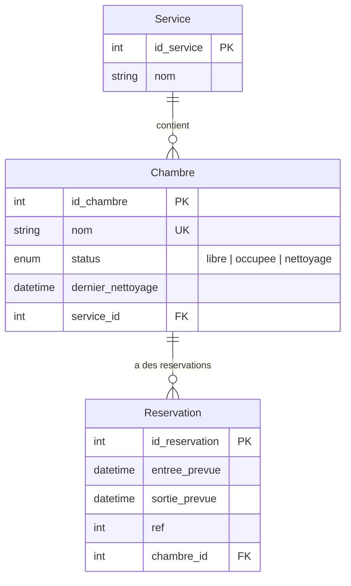
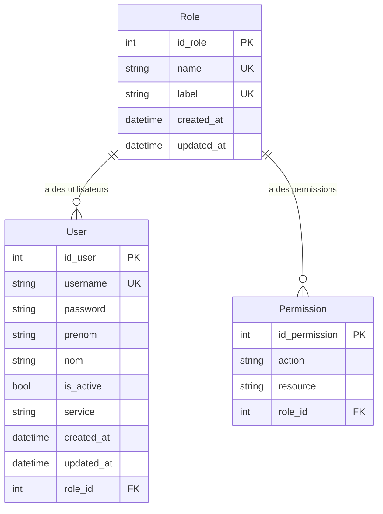
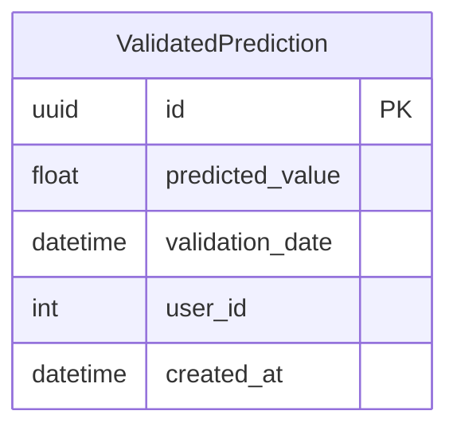

# MCD — Modèles Conceptuels de Données

## 1. Base de données `cmv_patients`

```mermaid
erDiagram
    Patient {
        int id_patient PK
        enum civilite "Monsieur | Madame | Autre"
        string nom
        string prenom
        datetime date_de_naissance
        string adresse
        string code_postal
        string ville
        string telephone
        string email
        datetime created_at
        datetime updated_at
    }

    Admission {
        int id_admission PK
        datetime entree_le
        bool ambulatoire
        datetime sorti_le
        datetime sortie_prevue_le
        int ref_reservation
        datetime created_at
        datetime updated_at
        int patient_id FK
    }

    Document {
        int id_document PK
        string nom_fichier UK
        enum type_document "health_insurance_card_certificate | authorization_for_care | ... | miscellaneous"
        datetime created_at
        int patient_id FK
    }

    OutboxEntry {
        int id PK
        string compensation_type
        json payload
        int retry_count
        enum status "pending | completed | failed"
        datetime created_at
        datetime last_attempted_at
    }

    Patient ||--o{ Admission : "a des admissions"
    Patient ||--o{ Document : "a des documents"
```

## 2. Base de données `cmv_chambres`

```mermaid
erDiagram
    Service {
        int id_service PK
        string nom
    }

    Chambre {
        int id_chambre PK
        string nom UK
        enum status "libre | occupee | nettoyage"
        datetime dernier_nettoyage
        int service_id FK
    }

    Reservation {
        int id_reservation PK
        datetime entree_prevue
        datetime sortie_prevue
        int ref
        int chambre_id FK
    }

    Service ||--o{ Chambre : "contient"
    Chambre ||--o{ Reservation : "a des reservations"
```

## 3. Base de données `cmv_gateway`

```mermaid
erDiagram
    Role {
        int id_role PK
        string name UK
        string label UK
        datetime created_at
        datetime updated_at
    }

    Permission {
        int id_permission PK
        string action
        string resource
        int role_id FK
    }

    User {
        int id_user PK
        string username UK
        string password
        string prenom
        string nom
        bool is_active
        string service
        datetime created_at
        datetime updated_at
        int role_id FK
    }

    Role ||--o{ User : "a des utilisateurs"
    Role ||--o{ Permission : "a des permissions"
```

## 4. Base de données `cmv_ml`

```mermaid
erDiagram
    ValidatedPrediction {
        uuid id PK
        float predicted_value
        datetime validation_date
        int user_id
        datetime created_at
    }
```
